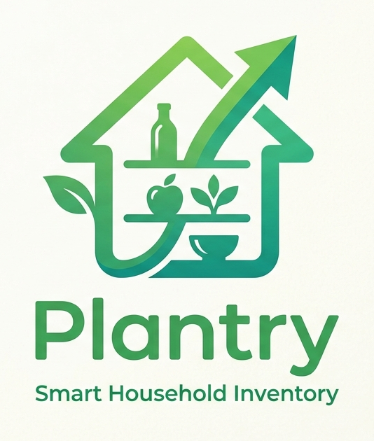

<div align="center">



### Your kitchen, finally on the same page as you.

**Snap a receipt, see what's in the house, and let it tell you what's for dinner.**

</div>

# Plantry

Most of us waste food we forgot we had, buy things we already own, and stare into a full fridge convinced there's nothing to eat. Not because we're disorganized — because keeping a kitchen in your head is a genuinely hard problem, and every app that promised to fix it asked for more effort than it ever gave back.

Plantry takes the friction out. It keeps a living picture of what's in your home — what it's worth, what's about to go off, and what you can actually cook tonight — and it keeps that picture current without turning you into a data-entry clerk.

---

## What makes it different

🧾 **Intake that's basically automatic.**
Photograph a receipt — or just forward the email — and Plantry reads every line, matches it to your catalog, and hands you a one-tap review. A full grocery haul logged in under a minute, not a tedious item-by-item slog.

🍳 **Recipes that know your kitchen.**
Every recipe shows what percentage of its ingredients you already have, what it'll cost to make, and whether anything's about to expire. Cooking stops being separate from "managing the pantry" — it *is* managing the pantry.

🧠 **An app that plans ahead.**
The AI planner builds a week of meals around what you've got, what you like, and what's on sale this week — quietly favoring the chicken that expires Friday so it never becomes science experiment in the back of the fridge.

💸 **Deal-aware by design.**
Local flyer deals flow straight into recipe costs, your shopping list, and stock-up nudges for the things you buy all the time. The planner leans toward what's cheap this week, not just what's in stock.

---

## The idea in one breath

A grocery run is how most food enters a home, so that's where Plantry earns its keep — turn the receipt into reality in seconds, and everything downstream (what you can cook, what to buy, what to plan) just *works*, because the pantry underneath it is always true.

It's **private** — shared only with your household, no social feed, no public anything. It's **not** a meal-kit subscription, not a barcode-scanner, and not a reskin of some other tracker. It's a ground-up product built for one job: making a real kitchen run itself.

---

## Tech stack

For the curious (and the contributors):

| Layer | Choice |
|---|---|
| Backend / domain | .NET 10 (C#) |
| Persistence | PostgreSQL |
| UI rendering | Razor Pages/MVC — server-rendered hypermedia |
| UI interactivity | htmx + Alpine.js — no Node, no bundler, no SPA |
| AI orchestration | Server-side .NET (`ChatClient`, OpenAI-compatible) |
| Container / deployment | Docker + .NET Aspire app model |

Under the hood it's a **modular monolith**: one .NET process, one PostgreSQL database, cleanly split into bounded contexts (Identity, Catalog, Inventory, Intake, Pricing, Shopping, and more). Boring where it should be, sharp where it counts.

---

## Getting started

### Prerequisites

- [.NET 10 SDK](https://dotnet.microsoft.com/download)
- [Docker](https://www.docker.com/) — .NET Aspire uses it to run PostgreSQL and friends locally
- [Aspire CLI](https://aspire.dev/get-started/install-cli/)

### Run the app

The solution is orchestrated by [Aspire](https://aspire.dev/) via `Plantry.AppHost`, which provisions PostgreSQL and runs the web app:

```sh
cd .\src\Plantry.AppHost\
aspire run
```

This opens the Aspire dashboard — your launchpad to the running web app, logs, traces, and resources.

### Build

```sh
dotnet restore
dotnet build
```

---

## Testing

Tests are organized by layer:

| Project | What it covers |
|---|---|
| `Plantry.Tests.Unit` | Domain unit tests |
| `Plantry.Tests.Architecture` | Bounded-context boundary rules |
| `Plantry.Tests.Integration` | Real-Postgres integration tests (via Testcontainers) |
| `Plantry.Tests.E2E` | End-to-end tests against a running app |

Run the fast suites:

```sh
dotnet test tests/Plantry.Tests.Unit
dotnet test tests/Plantry.Tests.Architecture
```

Integration tests need a Postgres connection string:

```sh
dotnet test tests/Plantry.Tests.Integration
```

E2E tests require a running instance and aren't part of the standard PR pipeline (see `.github/workflows/ci.yml`).

### Mutation testing

Domain logic in `Plantry.SharedKernel` and `Plantry.Catalog` (the conversion-resolution and
product-invariant core — `UnitConverter`, `Product`, `ExpiryDefaultResolver`) is checked with
[Stryker.NET](https://stryker-mutator.io/docs/stryker-net/introduction/). Stryker mutates one
source project per run, so each domain has its own config:

```sh
dotnet stryker --config-file stryker-config.json
dotnet stryker --config-file stryker-config.catalog.json
```

A surviving mutant is a test gap — the threshold breaks the build below 60% mutation score.

---

## Continuous integration

Every push to `main` and `slice/**`, and every PR into `main`, runs through GitHub Actions (`.github/workflows/ci.yml`): restore, build, unit/architecture/integration tests, and a code coverage gate. See the workflow file for exact thresholds.

---

## How Plantry is built — a fully agentic workflow

Plantry is engineered **agent-first**. Day-to-day development isn't a human typing in an IDE while an assistant autocompletes — it's a fleet of AI coding agents doing the implementation, with humans steering intent, reviewing outcomes, and setting the guardrails.

- **Issues are the unit of work.** Everything runs through [beads](https://github.com/gastownhall/beads) (`bd`) — a git-native issue tracker agents read and write directly. No work happens off-ticket.
- **Agents pick up and ship tickets end-to-end.** A worker agent claims a ready issue in its own worktree, implements it, runs the pre-flight gate (build → tests → an Opus critic pass), commits, and opens a PR. An orchestrator can run this loop hands-free across the backlog.
- **Nothing reaches `main` unguarded.** All work lands via `issue/<id>` branches and PRs behind branch protection: CI, a coverage gate, mutation thresholds, and architecture-boundary tests all have to pass. The agents earn the merge the same way a human would.
- **Conventions are encoded, not folklore.** Architecture decisions live in ADRs, domain rules in `Plantry.Tests.Architecture`, and project ethos in `AGENTS.md` / `CLAUDE.md` so every agent starts from the same playbook.

The result: the codebase you're reading was largely written by AI agents, but it's held to human standards by tests, reviews, and decision records — not vibes alone. (Some vibes. See the footer.)

---

## Repository layout

```
code/
├── src/
│   ├── Plantry.AppHost          # Aspire orchestration — run this to start the app
│   ├── Plantry.Web              # Razor Pages/MVC web app — UI and composition root
│   ├── Plantry.SharedKernel     # Cross-context primitives (IDs, value objects, events)
│   ├── Plantry.ServiceDefaults  # Shared service config (telemetry, health checks, ...)
│   │
│   │   # One domain + .Infrastructure pair per bounded context
│   │   # (domain logic + EF Core persistence): Identity, Catalog,
│   │   # Inventory, Intake, Recipes, MealPlanning, Pricing, Shopping
│   │
│   └── ...                      # plus migration tooling (Migrator, Migration.Grocy)
├── tests/                       # Unit, Architecture, Integration, Web, E2E
│
├── docs/                        # Vision, spec, architecture, ADRs, phase plans
├── deploy/ · scripts/ · tools/  # Backup/restore, ops scripts, Grocy importer
├── Plantry.sln · global.json    # Solution + SDK pin
├── Dockerfile · Caddyfile       # Container image + reverse-proxy config
└── AGENTS.md · CLAUDE.md         # The playbook agents start from (see above)
```

Each bounded context follows the same shape: a `Plantry.<Context>` project for domain logic and a `Plantry.<Context>.Infrastructure` project for its EF Core persistence.

---

<div align="center">

**Built with 🥬 and vibes** — by people who got tired of throwing out spinach.

</div>
