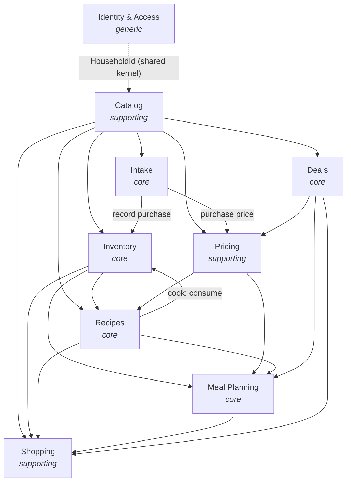

# ADR-010 — Bounded contexts and aggregate boundaries (modular monolith)

**Status:** Accepted · 2026-06-06 · Amended 2026-06-06

## Context

ADR-001 commits to DDD; ADR-008 makes the household the tenant and puts `household_id` on every row. Before modeling tables (ADR-003) or wiring application services we need the strategic map: which bounded contexts exist, how they relate, and where aggregate (transactional consistency) boundaries fall. Without it the single .NET process drifts into a big ball of mud where any service reaches into any table — the exact failure ADR-001 exists to prevent.

## Decision

Nine bounded contexts inside one process and one database — a **modular monolith**, not microservices. Each is classified by subdomain type: *core* = where Plantry competes (the VISION pillars), *supporting* = necessary but not differentiating, *generic* = standard, could be bought.

| Context | Type | Phase | Owns |
|---|---|---|---|
| Identity & Access | generic | 1 | Household (tenant), User, membership, auth/session |
| Catalog | supporting | 1 | Product (+SKUs, +product conversions), Unit, universal conversions, Location, Category, expiry defaults |
| Inventory | core | 1 | Stock lots, stock journal, FEFO consume, transfer, freeze/thaw, open |
| Intake | core | 1 | Receipt image, AI parse/match, import proposal, review-then-commit |
| Pricing | supporting | 1→2 | Price observations (purchase + deal), price read models |
| Recipes | core | 2 | Recipe (+ingredients, +directions), cook flow; fulfillment & cost as read models |
| Meal Planning | core | 2 | Meal plan, slots, AI plan proposal |
| Shopping | supporting | 1 | Shopping list, items, check-off |
| Deals | core | 3 | Store config, flyer ingestion, deal, match queue + memory |

## Context map

*Arrow = "supplies / is upstream of". The arrowhead points at the customer that depends on the supplier's contract.*

Patterns on the map:

- **`HouseholdId` is a shared kernel.** One value object, shared by every context and stamped on every aggregate root; the repository layer filters by it (ADR-008) so a request can only ever touch its own household. `UserId` (from Identity) rides along on journal/audit records for attribution.
- **Catalog is the upstream supplier** to every other context. Downstream contexts reference catalog entities **by ID only** — `ProductId`, `SkuId`, `UnitId`, `LocationId`. A recipe ingredient holds a `ProductId`, never an embedded `Product`; nothing downstream mutates the Product aggregate.
- **Inventory is the ground-truth supplier** to Recipes, Meal Planning, and Shopping (stock totals, fulfillment, low-stock). It *receives* purchase/consume/transfer commands from Intake and from Recipes' cook flow.
- **Pricing is a supporting read-side context** written by two suppliers (Intake = purchase prices, Deals = sale prices) and read by Recipes and Meal Planning for cost-per-serving. Keeping it out of Catalog stops a growing price time-series from polluting Catalog's role as stable reference data.
- **Intake and Deals each wrap an untrusted external source behind an Anticorruption Layer.** Per ADR-007 the AI is an untrusted function: its output lands in a proposal/staging model (the ACL) and only validated, user-confirmed data crosses into Inventory/Catalog/Pricing. The Flipp flyer source gets the same treatment in Deals — raw flyer → normalized `Deal` before anything downstream sees it.

## Aggregates (consistency boundaries)

One aggregate = one transactional consistency boundary. Aggregates reference each other by ID and are modified **one-per-transaction**, with the bounded exceptions noted.

- **Identity & Access** — `User` (credentials, identity, `household_id`) and `Household` (name, settings, member roster + invites) are two aggregates. Inviting a member is two steps across them (household issues invite → user accepts), never one transaction spanning both.
- **Catalog** — `Product` is the rich root: SKUs and product-specific conversions are child entities/value objects **inside** it (a SKU has no life outside its product). `Location`, `Unit`, `UniversalConversion`, and `Category` are small independent reference aggregates.
- **Inventory** — `ProductStock` is the root, keyed by `(household_id, product_id)`, holding that product's `StockEntry` lots as children and emitting immutable `StockJournalEntry` records. FEFO consume, transfer, and open all operate **within this one aggregate**, so a multi-lot consume is one aggregate in one transaction and the consistency boundary stays clean. *Rejected alternative:* `StockEntry`-as-root, which would force a multi-aggregate transaction for an ordinary FEFO deduction across lots.
- **Intake** — `ImportSession` is the root: receipt binary, parsed rows (jsonb), per-row match + confidence, status (`parsing → ready → committed/discarded`). Commit is an application-service orchestration issuing commands to *other* aggregates (Catalog create-product, Inventory record-purchase, Pricing record-observation), each its own transaction; the session records what it committed.
- **Pricing** — `PriceObservation`, an append-only record (sku/product, price, source = purchase|deal, merchant?, `observed_at`). "Latest price" and "cheapest active deal" are read models over it.
- **Recipes** — `Recipe` root with `Ingredient` children (`product_id`, qty, unit, group heading, order) and directions. Fulfillment % and cost/serving are **read models**, not aggregates — composed at query time from Recipe × ProductStock × PriceObservation. Cook is an application service: scale by servings, apply transient swap/skip choices, issue consume commands to Inventory.
- **Meal Planning** — `MealPlan` root (week + `Slot` children, each referencing a `recipe_id` and a meal-slot label). `MealSlotConfig` is a small household-scoped configuration aggregate: an ordered list of user-defined, free-text meal slots ("Breakfast", "Lunch", "Afternoon snack", "Dinner") that the plan's slots reference. `MealPlanProposal` is a separate staging aggregate (AI output + per-slot reasoning) that writes into `MealPlan` only on accept — same review-then-commit shape as Intake (ADR-007).
- **Shopping** — `ShoppingList` root with `Item` children (`product_id` or free text, qty, note, checked). Deal badges are a read-time join with Deals/Pricing, never stored on the item.
- **Deals** — `Store` (configured merchants), `Deal` (raw + normalized fields, matched `product_id`, status), and `DealMatchMemory` (`merchant + normalized_name → product_id`) so confirmed matches skip re-review. Confirming a deal writes a `PriceObservation`.

## Integration style

One process, one database (ADR-002/003), so contexts integrate by **in-process application-service calls** across module boundaries — no message bus. Where a downstream reaction should not become a hard dependency (Pricing reacting to a purchase; stock-up alerts reacting to a new deal), use **in-process domain events** instead of a direct call. Contexts are modeled *as if* separable — own module/namespace, own aggregates, ID-only references across boundaries — so the seams stay honest even though everything ships together. Splitting one out later, if ever needed, is contained because the boundary already exists.

## Consequences

- Hands the next layer (schema, ADR-003) its table groupings and FK discipline: cross-context references are IDs scoped within a household; no context reads another's tables directly — only its application services and read models.
- Reinforces ADR-001/004/007: the domain stays authoritative, AI/external input is anticorruption-layered into proposals, and composed views (fulfillment, cost, pantry totals) are server-side read models, not client-assembled.
- Gives `household_id` scoping (ADR-008) a precise home: a shared-kernel value object on every root, filtered at the repository layer.
- **Deliberately deferred:** physical module layout (one project with folders vs. multiple projects); whether to stand up a domain-event dispatcher in Phase 1 or wait for the first true cross-context reaction; and the Deals ACL specifics (tied to the unresolved Flipp access question).

## Amendment · 2026-06-06 — aggregate refinements from schema modeling (DATA-MODEL)

Concrete schema work refined three aggregate-boundary calls above:

- **`UniversalConversion` is deleted, not an aggregate (DM-8).** Every within-dimension conversion is linear scaling, fully captured by a `factor_to_base` column on `Unit` (base unit per dimension = `1`); `kg→g` is computed from the two unit rows that already exist. There is no pairwise conversion table. *Supersedes* the Catalog line's "universal conversions" and the §Aggregates "`UniversalConversion` … reference aggregate." Product-specific / cross-dimension conversions (`1 cup flour = 120 g`) remain as `ProductConversion` child rows inside `Product`.
- **Intake's "parsed rows (jsonb)" is a child table, not a blob (DM-15).** `ImportSession` holds `ImportLine` children (one per receipt line — individually edited, matched, dismissed, commit-tracked) plus a 1:1 `import_receipt` for the source bytes (ADR-009). jsonb is still present but demoted to `raw_parse` *per line* — the read-only AI proposal, the provenance half of the ACL — alongside a typed `suggested_confidence`. Only user-resolved typed fields commit. Commit is resumable per-line: each line records its `committed_journal_id` / `committed_price_observation_id` / `created_product_id`.
- **Merchant identity belongs in Catalog, not Deals (DM-16, pending).** The *identity* "which merchant" is stable reference data referenced by Intake, Pricing, and later Shopping — the same shape as `Location`/`Category`/`Unit`, so a small `Store` reference aggregate belongs in **Catalog**. Deals keeps its flyer-source *config* aggregate, which references `catalog.store` by ID. This removes the phase-inversion where Pricing (Phase 1→2) would depend on Deals. Phase-1 Intake stays on free-text `merchant_text`; `PriceObservation` gains an optional `store_id` soft-ref when `Store` lands. **Finalized (Pricing modeled, DM-16/DM-17, [pricing.md](../DomainDesign/DataModels/pricing.md)):** `price_observation` carries **both** `merchant_text` (populated Phase 1) and a nullable `store_id` soft-ref to `catalog.store` (populated once `Store` lands); the `Store` reference aggregate is confirmed Catalog-owned but its table is deferred to land with Deals. This **supersedes** the §Aggregates "Deals — `Store` (configured merchants)" line, which is no longer a fallback.

## Amendment · 2026-06-22 — Deals design chain + phase renumber (plantry-jfu)

The Deals context was modeled (journeys → ubiquitous language → domain model → schema, [DataModels/deals.md](../DomainDesign/DataModels/deals.md), DM-22). Two things land here:

- **Deals aggregates refined — `Store`, `Deal`, `DealMatchMemory` becomes four (DM-22).** *Supersedes* the §Aggregates "Deals — `Store` (configured merchants), `Deal`, `DealMatchMemory`" line. (a) The merchant **identity** `Store` is **Catalog-owned** (DM-16, above), so Deals owns a **`StoreSubscription`** *config* aggregate (which merchants the household pulls from) instead of `Store`. (b) A **`FlyerImport`** aggregate is added — the ACL provenance envelope for the **persisted, async, retryable** flyer pull: the raw payload is quarantined as `raw_flyer` jsonb, with pull status (`pulling`/`parsed`/`failed`) and a `(household, store, flyer_external_id)` dedup key. ADR-010 originally folded "flyer ingestion" into `Deal`. (c) **`Deal` is its own long-lived root**, not a child of the import — browsed while active, feeding Pricing across its validity window, expiring on its own clock, retained as price history; it references its pull envelope by a within-context FK. This is the deliberate divergence from Intake's `ImportSession`→`ImportLine` children: the ACL **shape** mirrors Intake (persisted, review-then-commit, raw payload quarantined as jsonb — *not* Meal Planning's transient pending store, DM-21), but the **boundary** differs because a deal outlives its ingestion artifact. (d) `DealMatchMemory` is confirmed, keyed `(household, store, normalized_name) → product_id`, extended with optional **negative** memory on reject. Confirming a deal writes exactly one `pricing.price_observation` (`source=deal`, the seam Pricing pre-built — DM-17); a correction supersedes append-only.
- **The "Deals ACL specifics (tied to the Flipp access question)" deferral is resolved.** *Supersedes* the §Deliberately-deferred bullet. Flipp is accessed via its **unofficial API / scraper behind an `IFlyerSource` adapter** in `Plantry.Deals.Infrastructure` — the single fragile seam; the domain sees only normalized `RawDeal`s. The stage-2 matcher is an untrusted `IDealMatcher` over the household AI key (DM-7), exactly as Intake wraps its `ChatClient`. Only user-confirmed (or memory-auto-confirmed) deals cross into Pricing.
- **Phase renumber.** Build-sequence phases (the `PHASE-N-PLAN` files) are now: **P1 Pantry + Intake · P2 Recipes · P3 Meal Planning · P4 Take Stock (inventory reconciliation) · P5 Deals.** The original roadmap had bundled Recipes + Meal Planning as one phase with Deals right after; reality split Recipes/Meal Planning into P2/P3, and an inventory-reconciliation **Take Stock** phase ([PHASE-4-PLAN.md](../PHASE-4-PLAN.md)) was then injected at P4, moving Deals to **P5**. This ADR's §Bounded-contexts table's "Meal Planning · 2" / "Deals · 3" rows are the *original* plan and are read against this scheme rather than rewritten in place. ARCHITECTURE and the Pricing/Intake/Shopping/Catalog data-model "Deals (Phase 3/4)" references are reconciled to **Phase 5** alongside this amendment. (VISION no longer carries a numbered delivery plan — the roadmap lives in the `PHASE-N-PLAN` files.)

## Amendment · 2026-07-01 — Pricing deal-support seam: designed here, built in P5 (Phase-5 planning)

Phase-5 planning found the Pricing deal seam this ADR/DM-17 designed had **never been implemented**: `price_observation` carried only `PriceSource.Deal` (the enum), with no validity-window/`store_id` columns and no "cheapest active deal" read model. The 2026-06-22 amendment's phrase *"the seam Pricing pre-built"* was therefore **tense, not fact** — designed here, not yet built.

- **Built in Phase 5, slice P5-P** as an **additive extension to `price_observation`**: nullable `valid_from`/`valid_to` + `store_id`, `RecordObservation(source=deal, …)`, and the source-filtered "cheapest active deal" / "effective price" read models (DM-17 as written).
- **Single table, no split, no inheritance.** A Phase-5 exploration of a separate `deal_observation` table (and of TPH/TPT/TPC) was **rejected** to stay within this ADR's boundary: **Pricing is the single owner of all price data *and* all price read models.** Purchase-vs-deal isolation is a within-Pricing concern, handled by `source`-filtered reads — not a bounded-context boundary, so it does not warrant a second table. This upholds DM-17's rationale ("the read model must be queryable entirely within Pricing").
- **Consumers read Pricing, never Deals.** The Shopping deal badge and Recipes/Meal-Planning deal-aware cost read Pricing's read models; **Deals exposes no active-deal port** and is a pure writer. A momentary Phase-5 design that put an `IActiveDealReader` in Deals (with Shopping reading it) was **reverted** as a boundary regression. Wiring the consumers (Shopping badge, C7 deal-blind cost readers) is real Phase-5 work (P5-9/P5-9b), not free activation — but requires **no new Deals port**, preserving the clean star topology around Pricing.

## Amendment · 2026-07-10 — Intake: `Confirmed` is staging-only; commit is the single human gate (plantry-v0wl)

The exceptions-first review rewrite (epic plantry-e3re) formalizes what a line's `Confirmed` status *means* and where the human gate actually is. This sharpens — it does not weaken — the ACL discipline of ADR-007 / Gate 5 ("only user-resolved typed fields commit").

- **`Confirmed` is a staging state, not a pantry write.** An `ImportLine` moving `Pending → Confirmed` records the household's *approved resolution* of that line inside the `ImportSession` aggregate (the ACL). **Nothing reaches Inventory/Catalog/Pricing until `CommitSessionCommand` runs.** Confirming a line — whether by the user editing it or by the commit-time auto-confirm below — is a within-staging transition, fully reversible via **`ImportLine.Reopen()`** (`Confirmed → Pending`, clearing the user-resolved fields so the server-side prefill chain re-derives from the AI suggestions; the once-set suggestion/receipt data is never touched). `Reopen` is the undo-of-a-resolve and the "Wrong product — review again" rematch; it is the confirmed-line sibling of `Restore` (`Dismissed → Pending`).
- **"Add to pantry" is the single human gate — it confirms the batch.** The user does **not** have to click every high-confidence row before committing. At commit time, `CommitSessionCommand` **auto-confirms still-`Pending` lines server-side** when *both* hold: the AI was `SuggestedConfidence.High` **and** the same server-side prefill chain the review page renders (`ReviewPrefill.ComputePrefill`) yields a **complete** resolution — an existing product, quantity > 0, and both a unit and a location. This is not an AI write: the values are **re-derived on the server from the stored line**, never echoed back by the client (Gate 5 holds — the browser never round-trips AI-suggested values), and the domain gate "only `Confirmed` lines commit" is unchanged (auto-confirm simply runs the `Pending → Confirmed` transition first). Pressing "Add to pantry" is therefore the *one* explicit human confirmation for the whole batch of already-vetted, high-confidence lines.
- **Non-qualifying `Pending` lines block the commit — never silently skipped.** A `Pending` line that does **not** qualify (Low/None confidence, or High with an incomplete prefill — e.g. the matched product has no default location and the receipt gave none) fails the entire commit with a descriptive error naming the line, exactly as a genuinely unresolved line must. Commit stays all-or-nothing at the staging boundary: no line is half-committed and the session is not marked `Committed`. (This tightens the earlier "non-confirmed lines are skipped" resumability note, which referred to *already-committed* and *dismissed* lines within a resumed commit — a bare unresolved `Pending` line is now a hard block, not a skip.)
