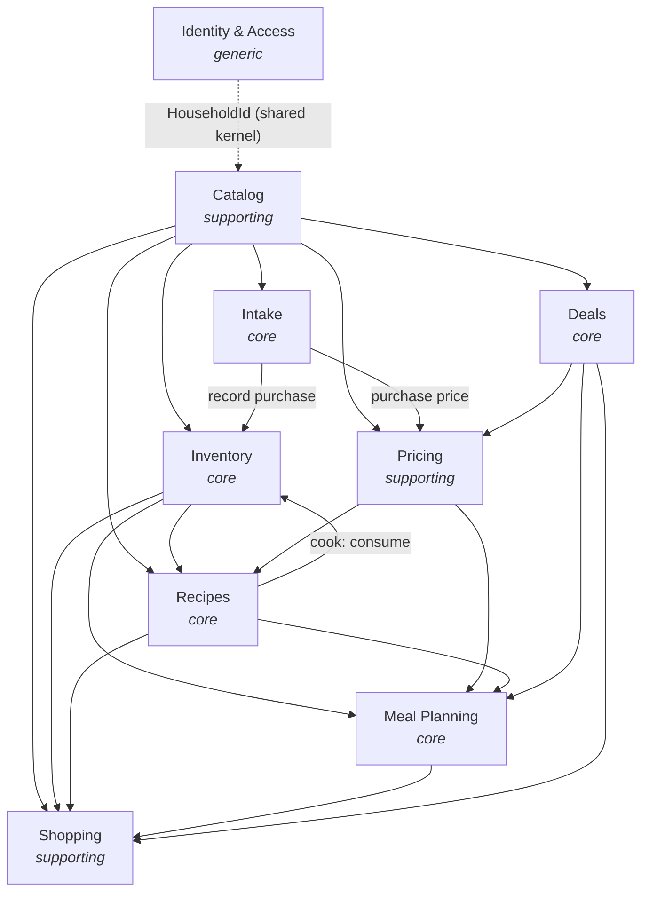

# Plantry — Architecture

> Describes the system as it is built. Decision rationale lives in [ADRs/](ADRs/index.md).
> See VISION.md (why) and SPEC.md (what).

---

## Guiding principle

**Domain-Driven Design is the lens for every decision.** The domain model is the system; everything else (UI, persistence, transport) serves it. When a choice would split, duplicate, or leak domain logic, that choice is wrong.

---

## Technology stack

| Layer | Choice |
|---|---|
| Backend / domain | .NET (C#) |
| Persistence | PostgreSQL |
| UI rendering | .NET Razor Pages/MVC (server-rendered hypermedia) |
| UI interactivity | htmx (~14KB) + Alpine.js (~15KB) |
| Frontend build toolchain | None — no Node, no bundler |
| AI orchestration | Server-side .NET (`ChatClient`, OpenAI-compatible) |
| Container / deployment | Docker + .NET Aspire app model |

---

## Overall structure

Plantry is a **modular monolith**: one .NET process, one PostgreSQL database, nine bounded contexts. There is no second backend tier, no JavaScript server, no message broker, and no SPA.

```
Browser
  │  HTML fragments (htmx swaps)
  │  Local draft state (Alpine x-data)
  ▼
.NET web app  (Razor Pages / MVC controllers)
  │  C# calls — no serialization boundary
  ▼
Application services  (one per bounded context)
  │
  ├── Domain model  (aggregates, value objects, domain events)
  │
  └── Repositories  (EF Core → PostgreSQL)
```

The UI renders domain state directly as HTML. There is no client-side domain model to drift out of sync with the server.

---

## Bounded contexts

Nine contexts in one process and database, each with its own module/namespace, its own aggregates, and ID-only references across boundaries.

| Context | Type | Phase | Owns |
|---|---|---|---|
| Identity & Access | generic | 1 | Household (tenant), User, membership, auth/session |
| Catalog | supporting | 1 | Product (+SKUs, +conversions), Unit, Location, Category, expiry defaults |
| Inventory | core | 1 | Stock lots, stock journal, FEFO consume, transfer, freeze/thaw, open |
| Intake | core | 1 | Receipt image, AI parse/match, import proposal, review-then-commit |
| Pricing | supporting | 1→2 | Price observations (purchase + deal), price read models |
| Recipes | core | 2 | Recipe (+ingredients, +directions), cook flow; fulfillment & cost as read models |
| Meal Planning | core | 3 | Meal plan, slots, AI plan proposal |
| Shopping | supporting | 1 | Shopping list, items, check-off |
| Deals | core | 5 | Store subscription, flyer ingestion (ACL), deal, match queue + memory |

### Context map



*Arrow = "supplies / is upstream of".*

**Key relationships:**

- **Catalog** is the universal upstream supplier. All other contexts reference catalog entities by ID only (`ProductId`, `UnitId`, `LocationId`). Nothing downstream mutates Catalog.
- **Inventory** is the ground truth for stock. It receives commands (purchase, consume, transfer) from Intake and from Recipes' cook flow, and supplies fulfillment data to Recipes, Meal Planning, and Shopping.
- **Pricing** is an append-only read-side context fed by two writers (Intake for purchase prices, Deals for sale prices) and read by Recipes and Meal Planning for cost-per-serving.
- **Intake and Deals** each wrap an untrusted external source (AI model, flyer data) behind an Anticorruption Layer — raw input lands in a proposal/staging aggregate and only crosses into core contexts after user confirmation.

### Integration

Contexts communicate via **in-process application-service calls**. Where a downstream reaction should be loosely coupled (e.g., Pricing reacting to a purchase), **in-process domain events** decouple the caller from the subscriber without a message broker.

---

## Aggregates

| Context | Aggregate roots |
|---|---|
| Identity & Access | `User`, `Household` |
| Catalog | `Product` (with SKU + conversion children), `Location`, `Unit`, `Category` — within-dimension conversion is a `Unit.factor_to_base` column, not an aggregate (ADR-010 amended; DATA-MODEL DM-8). `Product` carries an optional `parent_product_id` (self-referencing FK) — see Product Groups below. |
| Inventory | `ProductStock` (keyed by `household_id + product_id`, holds `StockEntry` lots + emits immutable `StockJournalEntry`) |
| Intake | `ImportSession` (1:1 `import_receipt` source binary; `ImportLine` children carry the AI proposal in `raw_parse` jsonb + typed resolved fields; per-row match + confidence, status lifecycle) — DATA-MODEL DM-15 |
| Pricing | `PriceObservation` (append-only) |
| Recipes | `Recipe` (with `Ingredient` children); fulfillment and cost are read models, not aggregates |
| Meal Planning | `MealPlan` (with `Slot` children), `MealSlotConfig`, `MealPlanProposal` (AI staging) |
| Shopping | `ShoppingList` (with `Item` children) |
| Deals | `StoreSubscription`, `FlyerImport` (ACL provenance, `raw_flyer` jsonb quarantine), `Deal` (its own long-lived root), `DealMatchMemory` — the merchant *identity* `Store` is **Catalog-owned** (DM-16), referenced by ID (ADR-010 amended; DATA-MODEL DM-22) |

Aggregates are modified one-per-transaction. Cross-aggregate references are by ID only.

### Product Groups

`Product` supports a single level of parent/variant hierarchy via a nullable `parent_product_id` self-referencing FK.

| Concept | Rules |
|---|---|
| Parent product | Abstract — `parent_product_id IS NULL` and no `StockEntry` rows may reference it. Exists for grouping and recipe authoring. |
| Variant (child product) | `parent_product_id` is set; carries its own `default_unit_id` (independent of the parent). Max depth = 1 (a variant cannot itself be a parent). |

**Fulfillment rollup.** When a `Recipe.Ingredient` references a parent `ProductId`, the fulfillment read model sums `StockEntry.quantity` across all variant children of that parent (still FEFO-ordered within that set) to compute stock-on-hand for the ingredient.

**Disambiguation at cook time.** When the cook flow resolves a parent-typed ingredient, it does not auto-select a variant. Instead it produces a disambiguation set — all children of the parent whose `default_unit_id` (or any of their unit conversions) is compatible with the ingredient's unit. The user selects which variant(s) to consume and may split the quantity across multiple. Each confirmed selection issues an independent `ProductStock.Consume` call on the chosen child `ProductId`. If the disambiguation set is empty (no child shares the ingredient's unit), the ingredient is treated identically to a stockout.

---

## Multi-tenancy

The **household is the tenant**. Every aggregate root carries `household_id` as part of its identity. Tenancy is enforced at two layers:

1. **Repository layer** — every query includes `WHERE household_id = @id`; the value comes from the authenticated request context.
2. **PostgreSQL Row-Level Security** — a per-session variable (`SET app.household_id`) backs up the repository filter as defense-in-depth. A query that omits the `WHERE` clause physically cannot read another household's rows.

Single-user households are just a household of one. Inviting additional members is additive. Physical tenant isolation (for a future enterprise scenario) is achieved by a separate deployment, not a separate database.

---

## Consumption

All stock removal flows through a single primitive:

```
ProductStock.Consume(quantity, unit, reason, sourceRef?)
```

It converts units (via Catalog), orders lots FEFO, deducts across them, writes immutable `StockJournalEntry` rows, and reports shortfall. The `reason` field is a typed taxonomy — **Consumed**, **Discarded (wasted)**, **Correction** — so waste analysis reads the same journal as consumption history.

Cook is a Recipes-context orchestration that resolves swap/skip choices and issues one `Consume` per ingredient. Inventory never knows about recipes or substitutions.

---

## AI integration

AI is treated as an **untrusted external function**. The pattern is consistent across Intake (receipt parsing) and Meal Planning (plan proposal):

1. AI call runs server-side in .NET (OpenAI-compatible `ChatClient`).
2. Structured output lands in a **staging aggregate** (`ImportSession`, `MealPlanProposal`) as jsonb.
3. The user reviews and confirms.
4. **Only confirmation triggers writes** to Inventory / Catalog / Pricing / MealPlan.

The AI key is held server-side. The client never calls a model directly.

---

## Persistence

PostgreSQL is the single system of record. Notable choices:

- **jsonb** for semi-structured AI output (proposal rows, parsed receipt data).
- **`bytea` / large objects** for binary content (receipt images, recipe photos) — stored in the database alongside relational data for a single backup stream.
- **No domain logic in the database** — triggers, stored procedures, and computed columns that encode business rules are out of scope.

---

## Deployment

Plantry runs as a **self-contained Docker stack**: the .NET web app + PostgreSQL + a one-shot migrator (+ any background workers, e.g. the async email-intake processor) behind a reverse proxy. **.NET Aspire** is the app model for **local development** — its `AppHost` describes all services and their wiring and drives `dotnet run`.

**Production** is a single Linux host (a VPS — a remote homelab) running `docker compose` from a **hand-maintained `docker-compose.prod.yml`** (not the Aspire-generated composition; the AppHost is not the production runtime). Images build in CI and push to GHCR; deploy is `pull → run migrator → up`. Migrations are applied by the explicit migrator with owner credentials, never on app startup — the web app connects as the least-privilege `app_user` role. See [ADR-016](ADRs/ADR-016.md) (deployment topology + pipeline; supersedes [ADR-012](ADRs/ADR-012.md)), [ADR-017](ADRs/ADR-017.md) (migrations), and the [Operations runbooks](Operations/deployment.md).

---

## Open / deferred

- ~~**Import review form vs. Alpine**~~ — *resolved:* the form stays in htmx + Alpine using targeted OOB swaps over full-region repaint; web component escape hatch untriggered (ADR-013, accepted and validated by spike 2026-06-12).
- **AI image → text step** — Claude vision vs. dedicated OCR (see ADR-007).
- **AI model / provider selection** — per-task model (parse, match, plan) undecided.
- ~~**Auth mechanism specifics**~~ — *resolved:* delegated to ASP.NET Core Identity (auth, sessions, password hashing, lockout); we own only `household`/`household_settings`/`household_invite` (ADR-008 amended; DATA-MODEL DM-6).
- **Per-member roles / permissions** — deferred; v1 is flat.
- ~~**Physical module layout**~~ — *resolved:* multiple projects — one domain project per bounded context (`Plantry.Identity`, `Plantry.Catalog`, `Plantry.Inventory`, `Plantry.Intake`, `Plantry.Pricing`, `Plantry.Shopping`) with a paired `*.Infrastructure` project per context and a shared `Plantry.SharedKernel`.
- ~~**Domain-event dispatcher**~~ — *resolved:* wired in Phase 1 — an EF Core `DomainEventDispatchInterceptor` dispatches events after `SaveChanges`; Intake is the first emitter (`ImportSessionCommittedEvent`).
- **Deals ACL specifics** — tied to Flipp access question.
- ~~**Concrete PostgreSQL schema**~~ — *resolved:* all Phase-1 contexts decided — Pricing and Shopping schemas finalized in `DomainDesign/DataModels/pricing.md` and `DomainDesign/DataModels/shopping.md`. ADR-010 gives table groupings and FK discipline.
- ~~**Cloud deployment target**~~ — *resolved for single-tenant:* production is a single host running Docker Compose, deployed from CI via GHCR (ADR-016); migrations run via an explicit migrator (ADR-017). A **hosted, multi-household** offering remains deferred until it is on the roadmap.
- **Third-party self-hosting / OSS** — built for and pipeline-supported (ADR-016, [self-hosting.md](Operations/self-hosting.md)); the project proceeds as if OSS-bound, with the actual publish flip deferred (non-blocking).
- **CI-gating open items** — local-preflight scope (full vs. pre-filter) and whether E2E runs in CI; see [cicd-rollout-plan.md](Operations/cicd-rollout-plan.md).
