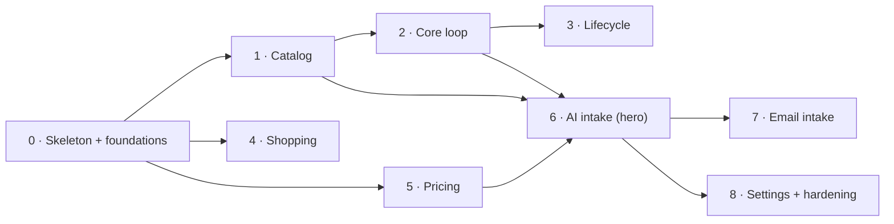

# Plantry — Phase 1 Delivery Plan

> How Phase 1 (Pantry + Intake) gets built: solution structure, testing bar, design-system integration, and the vertical slices in build order.
> Authority: [VISION.md](VISION.md) (why) · [SPEC.md](SPEC.md) (what) · [ARCHITECTURE.md](ARCHITECTURE.md) (how) · [DataModels/](DataModels/index.md) (shape) · [ADRs/](ADRs/index.md) (rationale). This file holds *sequence*.

---

## Principles for the build

1. **Vertical slices, not horizontal layers.** Every slice pierces the full stack — Razor page → application service → domain → EF → Postgres → back as an htmx fragment — and ships something a logged-in user can do. No "build all the repositories first" phase.
2. **Walking skeleton first.** The riskiest, most cross-cutting plumbing (tenancy/RLS, auth, migrations, the test harness) is established in Slice 0 against one trivial feature, before any real domain work leans on it.
3. **The hero feature comes last, not first.** The AI receipt flow (§2e) is the centerpiece, but it sits on top of Catalog + Inventory + Pricing. We build the spine it needs first, so by the time we build it those contexts are proven.
4. **Domain stays pure.** Domain projects reference only the SharedKernel — never EF Core, ASP.NET, or another context. This is what keeps the unit-test layer fast and the boundaries honest.

---

## Solution structure (separate projects from the start)

A modular monolith physically expressed as separate projects. Each bounded context is two projects: a **pure domain+application** project (no infrastructure dependencies) and an **infrastructure** project (EF Core, repositories, schema mapping). `Plantry.Web` is the only composition root that references everything.

| Project | Kind | Depends on | Holds |
|---|---|---|---|
| `Plantry.SharedKernel` | lib | — | `HouseholdId`, `AggregateRoot`/`Entity`/`ValueObject` bases, `Money`, `Quantity`, `Result`/`Error`, `IDomainEvent`, `IClock` |
| `Plantry.Identity` | lib | SharedKernel | `Household`, household settings, invite; thin layer over ASP.NET Core Identity (DM-6/7) |
| `Plantry.Identity.Infrastructure` | lib | Identity, EF | `identity` schema, Identity store wiring, seeding hook |
| `Plantry.Catalog` | lib | SharedKernel | `Product` (+SKU, +conversion), `Unit`, `Category`, `Location`; conversion + expiry-default logic |
| `Plantry.Catalog.Infrastructure` | lib | Catalog, EF | `catalog` schema, repos |
| `Plantry.Inventory` | lib | SharedKernel | `ProductStock` (+`StockEntry`, +journal), `Consume`/FEFO, transfer/freeze/thaw/open |
| `Plantry.Inventory.Infrastructure` | lib | Inventory, EF | `inventory` schema, `FOR UPDATE` + `xmin` concurrency |
| `Plantry.Pricing` | lib | SharedKernel | `PriceObservation`, unit-price materialization, read models |
| `Plantry.Pricing.Infrastructure` | lib | Pricing, EF | `pricing` schema |
| `Plantry.Shopping` | lib | SharedKernel | `ShoppingList` (+items) |
| `Plantry.Shopping.Infrastructure` | lib | Shopping, EF | `shopping` schema |
| `Plantry.Intake` | lib | SharedKernel | `ImportSession` (+`ImportLine`), ACL, AI pipeline ports, commit orchestration |
| `Plantry.Intake.Infrastructure` | lib | Intake, EF, `ChatClient` | `intake` schema, AI adapter (from `ReceiptPoc`), blob storage |
| `Plantry.Web` | Razor Pages | all of the above | pages, htmx fragments, RLS middleware, composition root, DI |
| `Plantry.EmailWorker` | worker | Intake(.Infrastructure) | async email-intake processor *(added in Slice 7)* |
| `Plantry.AppHost` | Aspire | Web, EmailWorker | service graph, Postgres resource, local + homelab run |
| `Plantry.ServiceDefaults` | Aspire | — | telemetry, health, resilience defaults |

**Dependency rules (enforced, not just intended):**

- A context's Domain project references **only SharedKernel**. No EF, no ASP.NET, no sibling context.
- Cross-context calls go through **application-service interfaces** with **ID-only** arguments (`ProductId`, `UnitId`, …) — never a foreign aggregate. This mirrors the context map in ARCHITECTURE.md.
- Infrastructure projects are referenced **only** by `Plantry.Web` / workers for DI wiring — never by another context's domain.
- An architecture test (NetArchTest or similar) in the test suite **fails the build** if any of these rules is violated. Boundaries you can't enforce, you don't have.

> Cross-context reactions (e.g. Pricing reacting to a purchase) use **in-process domain events**. The dispatcher is deferred until the first real reaction appears — that is the Intake-commit slice (Slice 6), so we wire it then, not in Slice 0.

---

## Testing strategy — the bar is "regressions are structurally hard"

A real pyramid: a large base of fast unit tests, a solid middle of integration tests against real Postgres, and a thin top of end-to-end journeys. Every slice ships with its tests; "done" is defined by them.

| Layer | Tooling | What it covers | Speed / count |
|---|---|---|---|
| **L1 — Domain unit** | xUnit (built-in `Assert`) | Aggregates, value objects, invariants. The behavior-heavy ones: `Consume`/FEFO ordering, expiry materialization chain, unit-conversion resolution, ACL field-quarantine mapping, confidence → row-state. | Milliseconds, in-memory. The **majority** of all tests. |
| **L1b — Property-based** | CsCheck / FsCheck | The math that must hold for *all* inputs: unit conversion round-trips, FEFO total-ordering/determinism, expiry-date arithmetic across freeze/thaw/open. | Fast; targets the gnarly invariants. |
| **L2 — Application/service** | xUnit + in-memory fakes | Orchestration logic with faked repositories — commit resumability, "submit all" iteration, shortfall handling. | Fast. |
| **L3 — Integration** | xUnit + **Testcontainers** (bare Postgres) + **Respawn** | EF mappings, migrations apply to a fresh DB, repository queries, composite-FK + `CHECK` constraints, `FOR UPDATE`/`xmin` concurrency, and — critically — **RLS tenant isolation**: a proof test that a query for household A physically cannot read household B's rows. | Seconds; one suite per context. |
| **L4 — HTTP/contract** | `WebApplicationFactory` | Endpoints return the right htmx fragment; auth + household scoping enforced at the boundary; rendered fragments are snapshot/approval-tested to catch UI regressions. | Seconds. |
| **L5 — End-to-end** | **Playwright** + **`Aspire.Hosting.Testing`** | The few critical journeys only, against the *whole* service graph booted from the AppHost: register→login; manual add→see in pantry→consume; receipt upload→review→commit. | Slow; deliberately few. |

> **Why both Testcontainers and Aspire?** They sit at different layers, not in competition. **L3** needs a *bare* Postgres with no app host — booting the full graph per repository test would be dead weight — so Testcontainers (+ Respawn for fast inter-test reset) owns the integration suite. **L5** needs the *real* wiring, so `Aspire.Hosting.Testing` spins the same AppHost graph we run in dev. If minimizing dependencies later matters more than L3 speed, L3 can be re-routed through Aspire's testing host and Testcontainers dropped.

**Regression guardrails (the "rock solid" part):**

- **CI runs the whole pyramid on every PR.** Red = no merge.
- **Coverage gates on domain projects** (high threshold; build fails below it). Coverage is necessary but not sufficient, so —
- **Mutation testing (Stryker.NET) on the core domain** — `Consume`/FEFO, expiry, conversion. This is what proves the tests *assert behavior* rather than merely execute lines; a surviving mutant is a test gap.
- **Migrations are checked in and must apply cleanly to an empty database** in CI; the RLS-isolation test runs against the migrated schema, so a migration that forgets a policy fails the build.
- **The architecture test** (boundary rules above) runs as part of L1.

The intent: by the time a slice is merged, the only way to break its behavior later is to also break a test — and the tests are hard to fool.

---

## Design-system integration (using `ClaudeDesignProto` as the template)

The proto is React + a rich CSS theme; our stack is server-rendered Razor + htmx + Alpine (ADR-004/005). So we **lift the look, not the framework**:

- **`plenish.css` is the reusable asset.** Its design tokens (the three themes — *Hearth* default, *Market*, *Slate* — plus radii, shadows, typography) and component classes move nearly verbatim into `Plantry.Web/wwwroot/css`. Fonts (Hanken Grotesk, Spline Sans Mono) self-hosted.
- **The JSX component tree becomes Razor partials + htmx fragments.** `Sidebar` → the `_Layout` shell; `ItemRow`/`NonStockRow` → `_ImportLineRow.cshtml` swapped via htmx; the scanning/done stages → server states. The proto is the **interaction spec** for the §2e review form — confidence colour-coding, inline edit, unmatched create/link, the progress/commit bar are all already designed there.
- **Alpine carries local draft state** on the review form (unsaved row edits), exactly the case ADR-005 flagged — with the documented escape hatch to web components if Alpine strains.
- **The three themes** map directly onto the theme setting in App Settings (§7f); the proto's tweaks panel becomes a dev-only toggle.

> ✅ **Nav layout — decided: responsive shell.** Sidebar (the proto's layout) on wide viewports; collapses to SPEC.md's mobile-first bottom nav on narrow. One shell, breakpoint-driven, built in Slice 0.

---

## The slices

Build order top to bottom. Each is independently shippable and testable. Estimated relative size in "T-shirt" terms — these are sequencing aids, not commitments.

| # | Slice | Contexts | Size | Blocks | Status |
|---|---|---|---|---|---|
| 0 | Walking skeleton + foundations | Identity | L | everything | ✅ Done (`c7c7d1c`) |
| 1 | Catalog & reference data | Catalog | M | 2, 6 | ✅ Done |
| 2 | Manual add + Pantry + consume (**the core loop**) | Inventory (+Catalog) | L | 3, 6 | ✅ Done |
| 3 | Stock lifecycle: transfer / freeze-thaw / open | Inventory | M | — | ⬜ Not started |
| 4 | Shopping list | Shopping | S | — | ⬜ Not started |
| 5 | Pricing write-path + read models | Pricing | S | 6 | ✅ Done (`46007a3`) |
| 6 | AI receipt intake (sync) + review form (**hero**) | Intake (+all) | XL | 7 | 🔄 Backend done (`226412f`); UI in progress (epic `plantry-pu6`) |
| 7 | Async email intake | Intake | M | — | ⬜ Not started |
| 8 | Settings, themes, Phase-1 hardening | all | M | — | ⬜ Not started |

> **Tracker legend:** ✅ Done · 🔄 In progress · ⬜ Not started. Update the Status column as each slice lands; this is the single source of truth for "where are we."

Slices 3 and 4 can run in parallel with later work once their dependencies are met; 4 (Shopping) is independent and can be pulled forward as filler.

---

### Slice 0 — Walking skeleton + foundations

> Landed in `c7c7d1c` ("Slice 0: walking skeleton + cross-cutting foundations") on `slice_1`.

**Goal.** A logged-in user in a seeded household sees an empty, themed Pantry shell — and the RLS isolation test passes. Nothing domain-rich; everything cross-cutting.

**Scope.**
- Solution + all projects above (minus EmailWorker) scaffolded; dependency rules + architecture test in place.
- Aspire `AppHost` wiring `Plantry.Web` + a Postgres resource; `dotnet run` brings up the stack locally.
- EF Core + migrations pipeline; **one schema per context** (DM-2); migration applies to empty DB in CI.
- **Tenancy/RLS plumbing** (ARCHITECTURE §Multi-tenancy): request → resolve `HouseholdId` from the authenticated principal → `SET app.household_id` per connection → repository base applies `WHERE household_id`; Postgres RLS policies as the backstop.
- **Auth** via ASP.NET Core Identity (DM-6): register a household + first user, login, logout, session.
- **Per-household reference-data seeding** on household creation (DM-9): units (mass/volume/count with `factor_to_base`), starter categories, starter locations (incl. one `frozen`).
- UI shell: `plenish.css` tokens imported, Hearth theme, responsive sidebar/bottom-nav shell, topbar, empty Pantry page.
- **Test harness stood up**: xUnit projects per context, Testcontainers integration base, Playwright project, CI running the full pyramid + coverage gate + Stryker config.

**Tests / done-when.** RLS-isolation integration test (household A cannot read B) is **green**; E2E smoke (register → login → see empty Pantry) passes; CI runs all five layers.

**Refs.** ARCHITECTURE §Multi-tenancy, §Deployment; ADR-008, ADR-012; DM-1/2/6/7/9.

---

### Slice 1 — Catalog & reference data

**Goal.** The user can manage the catalog the rest of the app references by ID.

**Scope.**
- `Product` aggregate: root + `ProductSku` + `ProductConversion` children (catalog.md).
- Product CRUD with the four expiry defaults (§7a); SKUs (§7a); soft-delete via `archived_at` (DM-4/10).
- **Product groups** (DM-19): `parent_product_id` self-ref on `product`; parent/variant CRUD in the catalog UI (§7a); app-layer invariant that stock cannot be recorded against a parent product.
- Units & conversions (§7c): within-dimension via `unit.factor_to_base` (DM-8); product-specific cross-dimension/density conversions; **conversion resolution** same-unit → same-dimension → product-conversion → fail loudly (DM-12).
- Locations CRUD with `frozen`/`ambient` type (§7b); categories with `default_due_days` + `sort_order`.
- Catalog pages (§7a–§7c).

**Tests / done-when.** Conversion resolution + expiry-default logic under heavy L1 + property tests (round-trips, fail-loud on unresolvable); repo/RLS integration green; E2E: create a product with a SKU and a conversion, edit it, archive it.

**Refs.** SPEC §7a–§7c; DataModels/catalog.md; DM-8/10/12/19.

---

### Slice 2 — Manual add + Pantry + consume *(the core loop)*

**Goal.** The full pantry loop with **no AI**: add stock manually, see it, use it. This is the first slice that delivers the product's reason for existing.

**Scope.**
- `ProductStock` root + `StockEntry` lots + immutable `StockJournalEntry` (inventory.md, DM-13/14).
- Manual add (§2c) incl. inline new-product create (§2d, reuses Slice 1); **expiry materialized at intake** via product → category → blank chain (DM-11); auto-suggest from defaults.
- Pantry list (§1a): product-level aggregated quantity, expiry badges (configurable threshold), search + filter, group-by category/location, display in the product's preferred unit.
- Product detail (§1b): per-lot entries, consumption history from the journal.
- **The single `Consume` primitive** (§1c, ARCHITECTURE §Consumption, ADR-011): unit conversion, **FEFO nulls-last with `entry_id` tiebreaker**, multi-lot deduction, shortfall report, `FOR UPDATE`+`xmin` serialization (DM-13).
- Expiry review (§1d): throw-out logged as **`Discarded` (waste)** vs `Consumed` — the reason taxonomy that VISION Phase 4 depends on.

**Tests / done-when.** `Consume`/FEFO/reason-taxonomy near-exhaustively unit-tested; **mutation-tested**; concurrency test proving two parallel consumes don't over-deduct (L3); E2E: add → pantry → consume → see journal.

**Refs.** SPEC §1a–§1d, §2c–§2d, §Consumption & waste; DataModels/inventory.md, cross-cutting-behaviour.md; ADR-011; DM-11/13/14.

---

### Slice 3 — Stock lifecycle: transfer / freeze-thaw / open

**Goal.** Stock moves between locations and changes state, with expiry recomputed correctly.

**Scope.**
- Transfer between locations (§1b) with expiry recalculation by direction (§Freeze/Thaw matrix): ambient→frozen, frozen→ambient, ambient→ambient.
- Open a lot → recompute from `default_due_days_after_opening` (location-independent).
- Lot-state transitions as **current state on `stock_entry`** (`frozen_at`/`thawed_at`/`is_open`), not journal rows (DM-14); prompt for manual expiry when the relevant default is unset.

**Tests / done-when.** Full transition matrix unit-tested (every direction × default-present/absent); property test on expiry arithmetic; E2E: move a lot to the freezer and watch expiry change.

**Refs.** SPEC §Freeze/Thaw Expiry, §1b; DataModels/inventory.md (resolved call #2); DM-14.

---

### Slice 4 — Shopping list

**Goal.** Build and work a shopping list. Independent of inventory; good parallel/filler work.

**Scope.**
- `ShoppingList` root + `ShoppingListItem` children (shopping.md, DM-18): **mutable working state** (edit-in-place, hard-delete on clear).
- View (§3a) with category grouping; manual add with product search or free text (§3b); item is exactly one of `product_id` | `free_text`.
- Check-off via `checked_at` timestamp + `checked_by` (§3c); clear completed (§3e); notes per item.
- App-layer duplicate-product merge; check-off **does not** write stock.

**Deferred (not this slice):** "add missing from recipe" (§3d, Phase 2), deal badges (§3f, Phase 3).

**Tests / done-when.** Item-shape constraint (`num_nonnulls = 1`) and check-off lifecycle tested at L1 + L3; E2E: add items, check some off, clear.

**Refs.** SPEC §3a–§3c, §3e; DataModels/shopping.md; DM-18.

---

### Slice 5 — Pricing write-path + read models

**Goal.** Capture purchase prices and expose "latest/representative price" reads. No standalone UI in Phase 1 — Pricing is fed by intake and read by display.

**Scope.**
- `PriceObservation` append-only root keyed `product_id` (+ nullable `sku_id`), `source = purchase` (DM-17); `merchant_text` free-text (DM-16), `store_id` left null until Phase 3.
- `unit_price` materialized at write, **soft-fail (null)** on cross-dimension — unlike `Consume`'s hard fail (DM-17).
- Read model: latest purchase price per product/SKU (consumed by intake display and product detail).

**Tests / done-when.** Soft-fail materialization + read-model correctness unit + integration tested. (No E2E of its own; exercised via Slice 6.)

**Refs.** DataModels/pricing.md; DM-16/17.

> Slice 5 is small and tightly coupled to Slice 6's commit; it may be built immediately before or folded into the start of Slice 6.

---

### Slice 6 — AI receipt intake (sync) + review form *(the hero)*

**Goal.** Photograph a receipt, review the parsed proposal in the §2e form, commit it to the pantry. The product's signature flow.

**Scope.**
- `ImportSession` root + `ImportLine` children + 1:1 `import_receipt` blob (intake.md, DM-15); status lifecycle `parsing → ready → committed`/`failed`/`discarded`.
- **AI as untrusted function** (ARCHITECTURE §AI integration, ADR-007): two-stage pipeline from `ReceiptPoc` (text → line items → confidence-scored catalog matches) behind the Intake adapter; payload quarantined in `raw_parse` jsonb + `suggested_confidence`.
- Photo upload (§2a) + scanning state.
- **The import review form (§2e)** — built from the proto: confidence colour-coding (high/low/none), inline per-row edit, unmatched create/link (§2d), bulk submit, progress + commit bar. Alpine for draft state.
- **Commit orchestration** (DM-15): per confirmed line, in its own transaction — Catalog create-product (if needed) → Inventory record-purchase (`Purchase` journal, `source = Intake`) → Pricing record-observation; **resumable**, never double-writes; records `committed_*` refs.
- **Domain-event dispatcher wired here** — the first true cross-context reaction.

**Tests / done-when.** ACL quarantine tested (raw never overwritten; only resolved fields commit); commit **resumability** tested (mid-batch failure re-runs cleanly, no double-write) at L2/L3 with a faked then real AI adapter; review-form fragments snapshot-tested; E2E: upload sample receipt → review → commit → items in pantry + price observations written.

**Refs.** SPEC §2a, §2e, §AI receipt review form; ARCHITECTURE §AI integration; DataModels/intake.md; ADR-007/010; DM-15/16.

---

### Slice 7 — Async email intake

**Goal.** Forward a receipt by email; it's waiting when you open the app.

**Scope.**
- `Plantry.EmailWorker` (Aspire-managed background processor).
- Forwarding-address config (§7d, `household_settings.email_intake_address`); inbound email → `import_receipt` (`source_type = email`, `email_from`/`email_subject`/`received_at`) → same pipeline → `ImportSession` `ready`.
- "N items ready to review" banner (§2b) → opens the **same** review form from Slice 6.

**Tests / done-when.** Worker integration test (email in → session ready); banner + reuse of review form verified; E2E: simulate forward → banner → review → commit.

**Refs.** SPEC §2b, §7d; DataModels/intake.md; ADR-012.

---

### Slice 8 — Settings, themes, Phase-1 hardening

**Goal.** Configuration surfaces and the Phase-1 quality pass.

**Scope.**
- App Settings (§7f): per-household AI key **encrypted at rest, never sent to client** (DM-7); expiry warning threshold; **theme picker** (the three proto themes).
- Intake settings (§7d): email address, category-level default expiry days.
- Account & Household (§7g): own login, invite/remove members, flat permissions.
- Hardening: accessibility pass, performance pass on Pantry aggregation, full regression sweep, mutation-test review on core domain.

> Meal Slots (§7h) is a Meal Planning (Phase 2) concern — **out of Phase 1**.

**Tests / done-when.** AI-key encryption round-trip tested; settings persist + re-render; whole pyramid green; mutation score on core domain meets threshold.

**Refs.** SPEC §7d, §7f, §7g; ADR-007/008; DM-7.

---

## Dependency graph

The critical path is **0 → 1 → 2 → 6**. Slices 3, 4, and 5 hang off that spine and can be scheduled flexibly.

---

## Open decisions to confirm before / during Slice 0

| # | Decision | Status / Recommendation |
|---|---|---|
| O-1 | Nav layout: proto's desktop sidebar vs SPEC's mobile-first bottom nav | ✅ **Decided:** responsive shell — sidebar wide, bottom-nav narrow |
| O-2 | Project granularity: Domain+App / Infrastructure split per context (vs one project per context) | ✅ **Decided:** split per context — keeps domain EF-free |
| O-3 | Integration-test Postgres tooling | ✅ **Decided:** Testcontainers + Respawn for L3; Aspire-testing for L5 (revisit only if dependency count outweighs L3 speed) |
| O-4 | Where the first migration baseline lives (per-context migration assemblies vs one) | Per-context, in each `.Infrastructure` |
| O-5 | Receipt image → text: Claude vision vs dedicated OCR (still open in ARCHITECTURE / ADR-007) | Decide before Slice 6, not before Slice 0 |

---

## Suggested first move

Slices **0 and 1** are the "first slice or two" we discussed: stand up the skeleton (auth, RLS, seeding, themed shell, full test harness), then make Catalog real. That gets the riskiest plumbing proven and gives Slice 2 — the actual pantry core loop — solid ground to land on.
