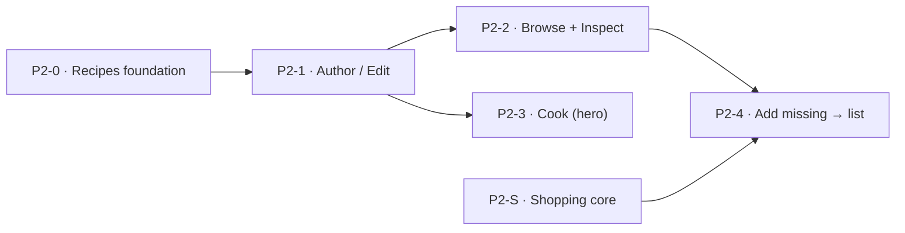

# Plantry — Phase 2 Delivery Plan

> How Phase 2 (Recipes, plus the Shopping list it depends on) gets built: the new context,
> the vertical slices in build order, and the dependency graph.
> Authority: [VISION.md](VISION.md) (why) · [SPEC.md](SPEC.md) (what) · [ARCHITECTURE.md](ARCHITECTURE.md) (how) · [DataModels/](DomainDesign/DataModels/index.md) (shape) · [ADRs/](ADRs/index.md) (rationale) · [DomainDesign/Domains/Recipes/](DomainDesign/Domains/Recipes/recipes-domain-model.md) (the Recipes design). This file holds *sequence*.
>
> Continues [PHASE-1-PLAN.md](PHASE-1-PLAN.md). The build **principles**, **solution structure / dependency rules**, **testing pyramid (L1–L5)**, and **design-system integration** established there carry over unchanged — this plan does not restate them, it builds on them.

---

## What Phase 2 is

The [Recipes bounded context](DomainDesign/Domains/Recipes/recipes-domain-model.md) end to
end — authoring, browsing with live pantry-fulfillment and cost, cooking through the single
`Consume` primitive — plus the slice of **Shopping** that Recipes requires.

Recipes is fully designed: [journeys](DomainDesign/Domains/Recipes/recipes-journeys.md) →
[ubiquitous language](DomainDesign/Domains/Recipes/recipes-ubiquitous-language.md) →
[domain model](DomainDesign/Domains/Recipes/recipes-domain-model.md) →
[data schema](DomainDesign/DataModels/recipes.md) (DM-20). This plan turns that design into code.

**Scope calls for this phase:**

- **Shopping comes along.** Recipes' J5 "add missing to shopping list" hard-depends on
  Shopping's `AddItems` write path and a list the user can actually see. The Shopping list was
  scoped in Phase 1 but never built; it is now a Phase-2 deliverable. It is fully designed
  ([shopping.md](DomainDesign/DataModels/shopping.md), DM-18) and already scaffolded
  (`Plantry.Shopping` / `.Infrastructure`), so Phase 2 **completes** it rather than starting it.
- **Shopping scope is lean-but-coherent.** Build the core list — view + category grouping,
  manual add (product or free text), check-off, clear — plus the J5 add-missing hook. Defer
  only per-item notes and Phase-3 deal badges. The aim is a list that stands on its own (so
  "add missing" doesn't dead-end), not a deliberately partial feature.
- **No new walking skeleton.** The cross-cutting plumbing from Phase-1 Slice 0 — tenancy/RLS,
  auth, migrations pipeline, the full test harness, the themed responsive shell — already
  exists. The only foundation work is the new `recipes` schema and project pair (P2-0).
- **Phase-1 debt stays in Phase 1.** Stock lifecycle (P1 Slice 3), async email intake
  (P1 Slice 7), and settings/themes/hardening (P1 Slice 8) remain tracked Phase-1 backlog,
  pullable as filler — they are **not** part of Phase 2.

---

## The slices

Build order top to bottom. Each is independently shippable and pierces the full stack
(Razor page → application service → domain → EF → Postgres → htmx fragment). Estimated
relative size in "T-shirt" terms — sequencing aids, not commitments.

| # | Slice | Contexts | Size | Blocks | Status |
|---|---|---|---|---|---|
| P2-0 | Recipes foundation (schema + skeleton) | Recipes (+Identity seed) | M | all | ⬜ Not started |
| P2-1 | Author / Edit a recipe | Recipes (+Catalog) | L | P2-2, P2-3 | ⬜ Not started |
| P2-2 | Browse + Inspect w/ live Fulfillment & Cost | Recipes (+Inventory, Pricing) | L | P2-4 | ⬜ Not started |
| P2-3 | Cook a recipe *(the hero)* | Recipes (+Inventory) | L | — | ⬜ Not started |
| P2-S | Shopping list core | Shopping (+Catalog) | S | P2-4 | ⬜ Not started |
| P2-4 | Add missing → shopping list | Recipes ↔ Shopping | S | — | ⬜ Not started |

> **Tracker legend:** ✅ Done · 🔄 In progress · ⬜ Not started. Update the Status column as each
> slice lands; this is the single source of truth for "where are we" in Phase 2.

P2-S is independent (it needs only Catalog, already done) and is the natural early/parallel
filler. The critical path is **P2-0 → P2-1 → P2-2 → P2-4**; the hero (P2-3) hangs off P2-1.

---

### P2-0 — Recipes foundation (schema + skeleton)

**Goal.** The `recipes` schema is live, the project pair exists, the eight default tags seed
per household, the architecture test guards the new boundary, and a logged-in user sees an
empty, themed Recipes page.

**Scope.**
- Scaffold `Plantry.Recipes` (domain + application; references **only** `SharedKernel`) and
  `Plantry.Recipes.Infrastructure` (EF Core, `recipes` schema). Wire into `Plantry.Web`
  (composition root) and `Plantry.AppHost`.
- EF migration for `recipe`, `recipe_ingredient`, `recipe_photo`, `cook_event`, `tag`,
  `recipe_tag` exactly per [recipes.md](DomainDesign/DataModels/recipes.md) — UUIDv7 PKs,
  composite `(household_id, id)` child FKs, `CHECK` constraints, per-household RLS policies
  (ADR-008). Applies clean to an empty DB in CI.
- `Tag` aggregate + `Tag.Create` / `Rename` / `SetCategory` (needed by seeding now, inline
  minting in P2-1).
- Seed the **8 default tags** at household creation, extending the existing per-household
  seeding hook in `Plantry.Identity.Infrastructure` (DM-9 pattern, as for Catalog reference data).
- Extend the NetArchTest boundary suite: the Recipes domain references only `SharedKernel`;
  cross-context access is ID-only through ports.
- Recipes nav entry + empty page shell (reuse the responsive shell from Slice 0).

**Tests / done-when.** RLS-isolation integration test on the `recipes` tables (household A
cannot read B) **green**; migration applies clean in CI; tag-seed integration test (new
household → 8 tags); architecture test green; E2E smoke: a logged-in user opens an empty
Recipes page.

**Refs.** DomainDesign/DataModels/recipes.md; DM-1/2/9/20; ADR-008/009; DataModels/conventions.md.

---

### P2-1 — Author / Edit a recipe

**Goal.** Create, edit, and save a recipe with ingredients, tags, and a photo, then land on
its Detail page. (J6 / J7)

**Scope.**
- `Recipe` aggregate (+ `Ingredient` entity) per domain model §3: `Create`, `Rename`,
  `SetSource` / `SetCookTime` / `SetPhoto` / `RemovePhoto` / `SetDirections`, `SetTags`,
  `ReplaceIngredients` (R3–R6), `ChangeDefaultServings(ScaleMode)` (J7 step 3). `recipe_photo`
  upsert / delete.
- `AuthorRecipe` application service (§7): product search via `ICatalogProductReader`; inline
  untracked-staple create via `ICatalogWriter` (C12 / J6 4a); unit-mismatch validation via
  `IUnitConverter`, surfacing the inline `ProductConversion` form and writing it to Catalog on
  save (C10 / R7); inline tag minting; name-uniqueness check (R1); assembles validated
  `Ingredient`s, then calls `ReplaceIngredients`.
- Catalog implements adapters for `ICatalogProductReader`, `ICatalogWriter`, `IUnitConverter`
  (reuse the existing Catalog conversion-resolution logic, DM-12, behind `IUnitConverter`).
- **Editor UI** (J6 / J7): name / servings / cook-time / source / photo upload / tag
  multi-select with inline create / plain directions editor (C13, Enter = next step) /
  ingredient rows (product search, qty + unit, group heading, reorder, delete); inline staple
  and inline conversion forms; servings-scale offer on edit. htmx fragments + Alpine draft
  state. Check the component library (`Pages/Dev/Index.cshtml`) first; propose any new
  component before building it.
- **Basic Detail page** — a read-only render of the aggregate (hero, meta, ingredient list,
  directions) as the J6-step-10 navigation target. Live fulfillment / cost are added in P2-2.
- Emits `RecipeCreated` / `RecipeUpdated`.

**Tests / done-when.** L1 invariants R1–R8; L2 `AuthorRecipe` orchestration with faked Catalog
ports (staple create, conversion write, uniqueness, scale modes); L3 schema / RLS +
composite-FK + `CHECK`; L4 editor and detail fragment snapshots; L5 create → save → Detail,
edit → save.

**Refs.** Recipes journeys J6/J7; domain model §3/§7/§8; recipes.md; C10/C12/C13; DM-12.

---

### P2-2 — Browse + Inspect with live Fulfillment & Cost

**Goal.** Browse all recipes with cookability and cost; inspect one with client-side servings
scaling. (J1 / J2 / J3)

**Scope.**
- `FulfillmentService` (domain): `Compute(recipe, servings) → FulfillmentResult` over
  `IInventoryStockReader`; untracked → satisfied; tracked → available vs scaled-required;
  parent product → roll up across all variant children (DM-19); flag ingredients expiring
  ≤ 4 days ("Use soon").
- `CostingService` (domain): `Compute → CostPerServing` over `IPriceReader` + `IUnitConverter`;
  `Full` / `Partial` / `None` completeness from priced-vs-costable counts; untracked staples
  excluded from the costable set.
- Inventory implements `IInventoryStockReader`; Pricing implements `IPriceReader`.
- **Browse** (J1 / J2): gallery / grid view (preference in `localStorage`), default sort
  Fulfillment-descending, sort by Name / Cook-time / Recently-added (local indexes) and
  Fulfillment / Cost (cross-context computed, ordered in the read layer after the reads —
  recipes.md Resolved call 6); tag-pill filter; live name search; "Use soon" filter; all
  filters AND-combined.
- **Inspect enrichment** (J3): fulfillment card with per-ingredient status pips, cost meta bar,
  servings stepper (Alpine, client-side scaling, no round-trip after load), "Use soon" flags;
  buttons to Cook (J4), Add-missing (J5), Edit (J7).

**Tests / done-when.** L1 fulfillment rollup and cost-completeness states (parent/variant,
untracked, partial pricing — the heavy ones); L2 read-model composition with faked Inventory /
Pricing; L4 browse + inspect fragments; L5 browse → inspect → scale servings.

**Refs.** Recipes journeys J1/J2/J3; domain model §6/§7/§8; recipes.md read-models; DM-13/17/19.

---

### P2-3 — Cook a recipe *(the hero)*

**Goal.** Cook a recipe; the pantry decrements through the single `Consume` primitive; cook
history is recorded. (J4)

**Scope.**
- `CookEvent` aggregate — append-only; `Record` factory only, no mutators, no delete.
- `CookRecipe` application service (§7 / J4): apply `ServingsScale`; the **Variant
  Disambiguation Picker** producing `IngredientResolution[]` (C7 auto-selects the best variant
  by stock / FEFO; C11 shows all variants, unit-incompatible ones visible-but-disabled); full
  CRUD at cook time — swap / skip / modify / add (C9); for each tracked, non-skipped line,
  `IInventoryConsumer.Consume(quantity, unit, reason="Recipe", sourceRef=cookEventId)`
  (ADR-011), **consuming whatever is available, never blocking on shortfall** (C8 / R9); skip
  untracked staples (C12); write the `CookEvent` as the authoritative anchor **first**, then
  drive the consumes as an **idempotent, reconcilable** follow-on keyed by `cookEventId`
  (cross-context = eventual consistency, **not** a shared transaction — ADR-014); emit
  `RecipeCooked` (with `cookedBy`, O2).
- Inventory implements `IInventoryConsumer`, wrapping its existing, mutation-tested `Consume`.
- **Cook UI**: confirmation screen, scaled quantities, the variant picker, per-line edit,
  shortfall-but-proceed, confirm → return to Detail with fulfillment re-computed.

**Tests / done-when.** L1 / L2 `CookRecipe` (skip untracked, consume-available, resolution
splits, CookEvent write); L2 recoverability (CookEvent written before consumes; consumes
idempotent + reconcilable via `sourceRef=cookEventId`, so a partial cook never decrements
without its anchor record — ADR-014); reuse Inventory's existing Consume coverage; L4 picker
fragments; L5 cook → pantry decremented → `cook_event` written.

**Refs.** Recipes journey J4; domain model §4/§7; R9; C7/C8/C9/C11/C12; ADR-011; DM-13/19.

---

### P2-S — Shopping list core

**Goal.** A working shopping list — view, add, check off, clear. Independent of Recipes; good
early / parallel work. *(This is the Shopping list moved out of Phase 1 — see
[PHASE-1-PLAN.md](PHASE-1-PLAN.md).)*

**Scope (lean-but-coherent).**
- `ShoppingList` root + `ShoppingListItem` children (DM-18, already scaffolded); an add-item
  application service applying the app-layer duplicate-product **merge** rule (shopping.md
  Resolved call 5).
- Seed one list per household (shopping.md Resolved call 1).
- **List view** (SPEC §3a): category grouping via a read-time join to
  `catalog.product.category` + an "Uncategorized" bucket for free-text items; unchecked-first
  ordering.
- **Manual add** (§3b): product search **or** free text; optional quantity + unit;
  `CHECK (num_nonnulls(product_id, free_text) = 1)`.
- **Check-off** via `checked_at` + `checked_by` (§3c); **clear checked** = hard-delete (§3e).
- *Defers:* per-item notes, deal badges (Phase 3), multiple named lists.

**Tests / done-when.** L1 / L3 item-shape constraint + merge + check-off lifecycle; L4 list
fragments; L5 add → check → clear.

**Refs.** SPEC §3a–§3c, §3e; DomainDesign/DataModels/shopping.md; DM-18.

---

### P2-4 — Add missing → shopping list

**Goal.** From a recipe's missing ingredients, one tap puts them on the shopping list.
(J5 — the Recipes ↔ Shopping seam.)

**Scope.**
- `AddMissingToShoppingList` application service (J5): from a fresh `FulfillmentResult` at the
  displayed servings, take the `Missing` lines (exclude untracked) and call Shopping
  `AddItems(product_id, scaledQty, unit_id, source="recipe", source_ref=recipeId)`.
- Shopping implements `IShoppingListWriter.AddItems` with provenance + the merge rule — this is
  the §3d "add missing from recipe" hook deferred from the Phase-1 Shopping slice.
- UI: an "Add X missing to shopping list" button on Detail (J3 step 6); the button changes to
  "Added ✓" and resets when servings change.

**Tests / done-when.** L2 add-missing (exclude untracked, scaling, merge with faked Shopping);
L3 merge against real Shopping; L5 inspect → add missing → item appears on the list.

**Refs.** Recipes journey J5; domain model §7; shopping.md §3d / DM-18.

---

## Dependency graph

The critical path is **P2-0 → P2-1 → P2-2 → P2-4**. P2-3 (the hero) hangs off P2-1 and can be
scheduled any time after it. P2-S is independent (needs only Catalog, already done) and is the
natural early/parallel filler.

---

## Suggested first move

Land **P2-0** to make the `recipes` schema and project real, then **P2-1** to make recipes
authorable — that gives the read-side (P2-2) and the hero (P2-3) solid ground. Pull **P2-S** in
parallel whenever there's slack, since it unblocks **P2-4** independently of the Recipes spine.
