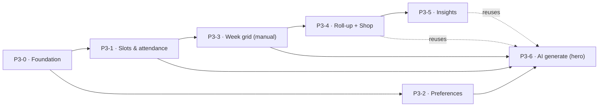

# Plantry — Phase 3 Delivery Plan

> How Phase 3 (Meal Planning — the AI meal planner) gets built: the new context, the vertical
> slices in build order, and the dependency graph.
> Authority: [VISION.md](VISION.md) (why) · [SPEC.md](SPEC.md) (what) · [ARCHITECTURE.md](ARCHITECTURE.md) (how) · [DataModels/](DomainDesign/DataModels/index.md) (shape) · [ADRs/](ADRs/index.md) (rationale) · [DomainDesign/Domains/MealPlanning/](DomainDesign/Domains/MealPlanning/mealplanning-domain-model.md) (the Meal Planning design). This file holds *sequence*.
>
> Continues [PHASE-2-PLAN.md](PHASE-2-PLAN.md). The build **principles**, **solution structure / dependency rules**, **testing pyramid (L1–L5)**, and **design-system integration** established in Phases 1–2 carry over unchanged — this plan does not restate them, it builds on them.

---

## What Phase 3 is

The [Meal Planning bounded context](DomainDesign/Domains/MealPlanning/mealplanning-domain-model.md)
end to end — a weekly calendar of meals the household can **hand-plan, auto-fill, or mix**, with
per-member dietary preferences, live pantry-fulfillment and cost rolled up from Recipes, a
"shop for the week" hand-off to Shopping, advisory plan insights, and an **AI planner** (the hero)
that proposes meals respecting every effective attendee's hard preferences.

Meal Planning is fully designed: [journeys](DomainDesign/Domains/MealPlanning/mealplanning-journeys.md) →
[ubiquitous language](DomainDesign/Domains/MealPlanning/mealplanning-ubiquitous-language.md) →
[domain model](DomainDesign/Domains/MealPlanning/mealplanning-domain-model.md) →
[data schema](DomainDesign/DataModels/mealplanning.md) (DM-21). This plan turns that design into code.

**Scope calls for this phase:**

- **The AI proposes recipes only (v1).** Product dishes ("frozen pizza") and free-text notes
  ("Takeout") are **manual** (C16). Proposing in-stock products is a natural future extension of the
  Waste lever — not built now.
- **The planner is deal-blind.** Deals moved to Phase 5 (C7), so cost comes from purchase-price
  history (Pricing, DM-17) only. The deal-aware bias and "active deals" generation input are a Phase-5
  enhancement; the seam (`IPriceReader`) is left open, not built.
- **Suggestions are transient.** AI proposals live in a **session-keyed pending store**, reviewed
  **inline on the plan grid** (MP-O7) — there is no separate proposal screen and no proposal table
  (the deliberate divergence from intake's persisted `ImportSession`). Suggestions don't survive a
  refresh in v1.
- **Product-meal eat→consume is deferred (C16).** Recipe meals consume via the existing Recipes Cook
  flow (ADR-011); product meals' consume rides with the future recipe-output feature (FUTURE.md). Meal
  Planning **never** calls `Consume` itself.
- **No new walking skeleton.** Tenancy/RLS, auth, the migrations pipeline, the full test harness, and
  the themed responsive shell already exist. The only foundation work is the new `meal_planning` schema
  + project pair, and **wiring `MealPlanningDbContext` into `RlsMiddleware`** (P3-0).
- **Fulfillment and cost are borrowed, never recomputed.** Meal Planning rolls up the Recipes read
  models (`FulfillmentResult`, `CostPerServing`) across a meal's dishes and the week — it owns no
  fulfillment/costing engine. `IInventoryStockReader` and `IShoppingListWriter` (from Recipes / P2-4)
  are reused as-is.

---

## The slices

Build order top to bottom. Each is independently shippable and pierces the full stack
(Razor page → application service → domain → EF → Postgres → htmx fragment). Estimated relative size
in "T-shirt" terms — sequencing aids, not commitments.

| # | Slice | Journeys | Contexts | Size | Blocks | Status |
|---|---|---|---|---|---|---|
| P3-0 | Meal Planning foundation (schema + skeleton) | — | MealPlanning (+Identity seed) | M | all | ⬜ Not started |
| P3-1 | Configure meal slots & attendance | J2 | MealPlanning (+Identity) | M | P3-3, P3-6 | ⬜ Not started |
| P3-2 | Set dietary preferences | J3 | MealPlanning (+Recipes, Identity) | M | P3-6 | ⬜ Not started |
| P3-3 | Week grid: view + manual assign + reschedule | J1/J5/J9/J7 | MealPlanning (+Recipes, Catalog) | L | P3-4, P3-6 | ⬜ Not started |
| P3-4 | Roll-up fulfillment & cost + Shop for the week | J6 | MealPlanning ↔ Recipes/Inventory/Pricing/Shopping | M | P3-5 | ⬜ Not started |
| P3-5 | Plan insights | J10 | MealPlanning (+Inventory, Recipes) | S | — | ⬜ Not started |
| P3-6 | AI generate plan *(the hero)* | J4/J8 | MealPlanning (+AI, all readers) | XL | — | ⬜ Not started |

> **Tracker legend:** ✅ Done · 🔄 In progress · ⬜ Not started. Update the Status column as each slice
> lands; this is the single source of truth for "where are we" in Phase 3.

P3-1 and P3-2 are independent of each other and parallelizable right after P3-0. The critical path is
**P3-0 → P3-1 → P3-3 → P3-4 → P3-6**; P3-2 feeds the hero in parallel, and P3-5 hangs off P3-4.

---

### P3-0 — Meal Planning foundation (schema + skeleton)

**Goal.** The `meal_planning` schema is live, the project pair exists, default meal slots seed per
household, the architecture test guards the new boundary, RLS isolates tenants, and a logged-in user
sees an empty, themed Meal Plan page.

**Scope.**
- Scaffold `Plantry.MealPlanning` (domain + application; references **only** `SharedKernel`) and
  `Plantry.MealPlanning.Infrastructure` (EF Core, `meal_planning` schema). Wire into `Plantry.Web`
  (composition root) and `Plantry.AppHost`.
- EF migration for `meal_plan`, `planned_meal`, `planned_dish`, `meal_slot_config`, `meal_slot`,
  `user_preference`, `tag_stance` exactly per [mealplanning.md](DomainDesign/DataModels/mealplanning.md)
  — UUIDv7 PKs, composite `(household_id, id)` child FKs, the `uuid[]` attendee columns, the
  `num_nonnulls` / `servings` / `source` / `stance` CHECKs, per-household RLS policies (ADR-008).
  Applies clean to an empty DB in CI.
- **Register `MealPlanningDbContext` in `RlsMiddleware.InvokeAsync`** (`Plantry.Web/Tenancy`) — the
  known gotcha: omit it and `_householdId` stays empty, so every read returns nothing while writes
  silently succeed. Add an HTTP-level read assertion to catch it (integration tests bypass the
  middleware).
- `MealSlotConfig` aggregate enough to **seed default slots** — Breakfast / Lunch / Dinner — at
  household creation, extending the existing per-household seeding hook in
  `Plantry.Identity.Infrastructure` (DM-9, as for Catalog reference data and the Recipes tag seed).
- Extend the NetArchTest boundary suite: the MealPlanning domain references only `SharedKernel`;
  cross-context access is ID-only through ports.
- Meal Plan nav entry (the "Today/Shop/Manage" banded nav) + empty week-grid page shell.
- **Build the `/Settings` hub shell** — the nav already links to `/Settings` from the sidebar footer
  (`_Layout.cshtml`) and the More hub (`More/Index.cshtml`), but no page exists yet (dead link). Stand
  up a hub page mirroring the Catalog hub (`Catalog/Index.cshtml` — a `catalog-section` + list of
  links) so the Phase-3 config screens have a home. Empty for now; P3-1 and P3-2 each add their own
  sub-page and hub link under a **"Meal Planning"** group on the hub, which keeps those two slices
  parallelizable. (Settings currently lives in the sidebar *footer*, not the Manage band — leave that
  placement as-is.)

**Tests / done-when.** RLS-isolation integration test on the `meal_planning` tables (household A can't
read B) **green**; migration applies clean in CI; slot-seed integration test (new household → 3 slots);
HTTP-level read smoke proving the RlsMiddleware wiring; architecture test green; E2E smoke: a logged-in
user opens an empty Meal Plan page **and the `/Settings` hub resolves (no longer a dead link)**.

**Refs.** DataModels/mealplanning.md; DM-1/2/9/21; ADR-008; conventions.md; the RlsMiddleware memory.

---

### P3-1 — Configure meal slots & attendance

**Goal.** Add / rename / reorder / remove meal slots and set each slot's default attendees. (J2)

**Scope.**
- `MealSlotConfig` aggregate (+ `MealSlot` entity) per domain model §4: `AddSlot`, `RenameSlot`,
  `ReorderSlots`, `SetDefaultAttendees`, `ArchiveSlot` (soft — M10). Label non-blank + unique among
  active slots, active ordinals contiguous (M9).
- `ManageSlots` application service (§7) over `IHouseholdMemberReader` (Identity) for the attendee
  roster. Removing a slot with planned meals **soft-archives** it (M10).
- **Slots settings UI** (J2 / §7h) at **`/Settings/MealSlots`** (household-scoped), linked from the
  P3-0 Settings hub: add with free-text label, drag/up-down reorder, rename, remove; per-slot
  default-attendees picker from the household roster. htmx fragments. Also wire the empty week grid's
  "configure slots" prompt (J2 trigger / J1 edge case) to deep-link here. Check the component
  library (`Pages/Dev/Index.cshtml`) first; propose any new component before building it.

**Tests / done-when.** L1 invariants M9/M10 (label uniqueness among active, contiguity, soft-archive);
L2 `ManageSlots` with a faked member reader; L3 schema / RLS + composite FK + the `uuid[]` default
attendees; L4 slots-editor fragment; L5 add → reorder → set attendees → archive.

**Refs.** MealPlanning journey J2; domain model §4/§7; mealplanning.md; M9/M10; DM-6/9.

---

### P3-2 — Set dietary preferences

**Goal.** Each member sets a Stance per tag — Required / Preferred / Disliked / Restricted — read by
the planner. (J3)

**Scope.**
- `UserPreference` aggregate (+ `TagStance` entity) per domain model §5: `SetStance` (upsert; `Neutral`
  **removes** the row), `ClearStance`; lazy `Create` on first edit (M6).
- `SetPreferences` application service (§7) over `ITagReader` (resolve `tag_id` → name + cosmetic
  category, from the Recipes vocabulary, DM-20) and `IHouseholdMemberReader`.
- **Preferences UI** (J3) at **`/Settings/Preferences`** (per-member — the signed-in user's own
  stances), linked from the P3-0 Settings hub: per-member screen listing tags grouped by cosmetic
  category, a Stance control per tag (Neutral = default/absent). htmx fragments.

**Tests / done-when.** L1 M6 (one stance per `(user, tag)`, Neutral = no row); L2 `SetPreferences` with
faked tag/member readers; L3 schema / RLS + composite FK + `stance` CHECK; L4 preferences fragment;
L5 set → change → clear a stance.

**Refs.** MealPlanning journey J3; domain model §5/§7; mealplanning.md; M6; DM-20/6.

---

### P3-3 — Week grid: view + manual assign + reschedule

**Goal.** View a week as a calendar, hand-assign meals (recipe / product / note), navigate weeks, and
drag-drop to reschedule — the manual planning spine, **no AI yet**. (J1 / J5 / J9 / J7)

**Scope.**
- `MealPlan` aggregate (+ `PlannedMeal`, `PlannedDish`) per domain model §3: `Start` (Monday-normalize,
  M8), `AssignMeal` (dishes **XOR** note, M13; date-in-week M2; servings ≥ 1 M3; **warn-not-block** on
  hard-stance violation, C9), `ClearMeal`, `MoveMeal` (relocate **or** swap within the week, C11;
  override travels, M4), `SetMealAttendees`. Emits `MealPlanned` / `MealMoved`.
- `AssignMeal` application service (§7 / J5) over `IRecipeReadModel` + `ICatalogProductReader` (validate
  a product dish references a real Catalog product) + the in-context `MealConstraintResolver` (effective
  attendees + hard-stance warn). `MoveMeal` service (J9) — no re-validation (C12).
- **Week-grid UI** (J1): one column per day, one row per active `MealSlot`; each cell renders its
  dishes (recipe/product names) or note chip, attendees, and a "+" affordance when empty; week
  prev/next nav (J7); a **"Manage planning"** affordance (e.g. a gear in the grid header) that
  deep-links to the Settings config screens — `/Settings/MealSlots` and `/Settings/Preferences` — so
  config is one tap from the planner even when the grid is full (complements the empty-grid "configure
  slots" prompt wired in P3-1). **Meal editor** (J5): add recipe/product dishes (search) + servings, or a note;
  per-instance attendance override. **Drag-drop reschedule** (J9): relocate onto empty, swap onto
  occupied. Check the component library first; propose new components before building.
- Fulfillment/cost cells render as **placeholders** here; the live roll-ups arrive in P3-4.

**Tests / done-when.** L1 invariants M2/M3/M4/M8/M13 + `MoveMeal` relocate/swap with override travel;
L2 `AssignMeal` / `MoveMeal` orchestration with faked Recipe/Catalog readers (product validation,
note-XOR-dishes, hard-stance warn); L3 schema / RLS + the `(meal_plan_id, date, meal_slot_id)` unique
+ `num_nonnulls` CHECK; L4 grid + editor fragments; L5 assign → reschedule → clear across weeks.

**Refs.** MealPlanning journeys J1/J5/J9/J7; domain model §3/§7; mealplanning.md; C9/C11/C16; M2–M13.

---

### P3-4 — Roll-up fulfillment & cost + Shop for the week

**Goal.** Each meal and the week show live fulfillment % and estimated cost; "Shop for this week" puts
the week's missing items on the shopping list. (J6 + the J1 enrichment)

**Scope.**
- `PlanFulfillmentService` (domain): `RollUp(meal | week) → MealFulfillment` — recipe dishes aggregate
  the Recipes `FulfillmentResult` at planned servings (`IRecipeReadModel`); product dishes resolve
  "in stock for planned quantity?" (`IInventoryStockReader`); note-meals contribute none.
- `PlanCostingService` (domain): `RollUp → MealCost` — recipe dishes sum `CostPerServing × servings`;
  product dishes use price × quantity (`IPriceReader`); propagates `CostCompleteness`. **Deal-blind**
  (C7).
- `ShopForWeek` application service (J6): across all `PlannedDish`es, recipe dishes contribute their
  `Missing` ingredients at planned servings, product dishes contribute the product itself if short;
  sum per product (exclude untracked) and call **`IShoppingListWriter.AddItems(..., source="meal_plan",
  source_ref=mealPlanId)`** — the **P2-4 seam, reused** (DM-18).
- **UI**: real fulfillment % + cost on each cell and a week total in the grid (replacing P3-3
  placeholders); "Use soon" flags on dishes whose recipe has stock expiring ≤ 4 days; a "Shop for this
  week" button that reports "N items added."

**Tests / done-when.** L1 roll-up math (recipe + product dishes, note-meals, completeness states);
L2 `ShopForWeek` (per-product sum, exclude untracked, merge) with a faked `IShoppingListWriter`;
L3 merge against real Shopping; L4 enriched grid fragment; L5 plan a week → shop → items appear on the
list (and re-shop merges, not duplicates).

**Refs.** MealPlanning journey J6 + J1 §4/§5; domain model §7/§8; mealplanning.md read-models;
DM-13/17/18/20; C7.

---

### P3-5 — Plan insights

**Goal.** An advisory insights panel surfaces what the plan ignores — expiring stock, over-budget,
repetition, unfilled slots, resolved conflicts. (J10)

**Scope.**
- `PlanInsightsService` (domain): `Inspect(plan) → PlanInsights`, read-side, recomputed on every
  change, **no new ports** — `UnusedExpiring` (expiring stock no planned dish consumes),
  `OverBudget` (week `MealCost` vs budget target), `Repetition` (recipe repeated this week / vs
  retained recent plans + `cook_event`), `UnfilledSlot`, `HardConflictResolved` (a meal split into
  separate dishes). Reuses `IInventoryStockReader`, `IRecipeReadModel`, and in-context plan history.
- **UI**: the advisory panel on the week view (J1 step 5) and during review (J4 step 7); insights are
  observations with links (e.g. tap `UnusedExpiring` → Recipes "Use soon"), **never block** (C12).

**Tests / done-when.** L1 each insight rule (expiring-not-used, over-budget, this-week + vs-last-week
repetition, unfilled, conflict-resolved); L2 composition over faked Inventory/Recipes reads;
L4 insights-panel fragment; L5 a plan with expiring stock → the callout appears and links.

**Refs.** MealPlanning journey J10; domain model §7; mealplanning.md read-models; C12/C15; DM-13/20.

---

### P3-6 — AI generate plan *(the hero)*

**Goal.** From the week view, auto-fill a scope (week / day / single meal) with AI-proposed meals that
respect every effective attendee's hard preferences; review them inline as ghost cells and
accept / reject / regenerate / edit, all on one screen. (J4 / J8)

**Scope.**
- `MealConstraintResolver` (domain): `Resolve(plannedMeal, slotConfig, preferences[]) → MealConstraints`
  — effective `AttendeeSet`, unioned hard stances, averaged soft stances (M4, MP-O4). The trusted heart
  of the planner; the AI is *given* constraints and its output is *validated* against them.
- `GeneratePlan` application service (§7 / J4): takes a `PlanningScope` (week / day / slot-series /
  single meal, C13) + `PlanningConstraints` (incl. `PlanningWeights` Cost/Waste/Variety summing to 100,
  default leans Waste, C14; optional budget target; ad-hoc tag prefer/exclude); gathers context
  (candidate recipes + tags + fulfillment + cost via `IRecipeReadModel`; expiring stock via
  `IInventoryStockReader`; recent cook/plan history for the Variety lever; per-meal `MealConstraints`);
  invokes the **untrusted `IMealPlanner`** (ADR-007); **validates the raw output in a transient ACL
  step** (reject malformed, auto-split hard conflicts into separate dishes per C6, leave impossible
  cells unfilled); writes validated `ProposedMeal`s to a **session-keyed pending store** (§6, MP-O7) —
  raw payload **never persisted**. Targets only empty cells unless `replace = true`.
- `RegenerateMeal` (J8): the `SingleMeal` convenience — re-propose one cell, rewrite that one pending
  entry, leave the rest untouched.
- `AcceptProposal` (J4): commit confirmed suggestions into `MealPlan` — **accept-all** via
  `ApplyProposal` (one transaction), **per-cell** via `AssignMeal(source: ai)` — re-validating each
  (the accept POST is the trust boundary); reject drops an entry, discard clears the store.
- `IMealPlanner` implemented in `Plantry.MealPlanning.Infrastructure` over the **household AI key**
  (DM-7), wrapping the `ChatClient` exactly as Intake does (slice 6c) — key set via user-secrets,
  never sent to the client.
- **Inline review UI** (J4 / J8, no separate screen): the `PlanningWeights` sliders + budget + scope
  buttons; in-scope empty cells render as **ghost cells** (dishes + reasoning snippet + rolled-up
  fulfillment/cost from P3-4) visually distinct from confirmed meals; per-cell ✓ accept / ✗ reject /
  ↻ regenerate / ✎ edit (edit = manual confirm via the P3-3 editor); a persistent "Accept all ·
  Discard · N pending" bar; the P3-5 insights panel recomputed over confirmed + pending. Pending store
  TTLs out on navigate-away.

**Tests / done-when.** L1 `MealConstraintResolver` (attendee resolution, hard union / soft average) +
the ACL validation (reject nonexistent recipe, hard-conflict split per C6, unfilled on no-match);
L2 `GeneratePlan` / `AcceptProposal` with a **faked `IMealPlanner`** (deterministic payloads):
empty-only targeting, accept-all atomicity, per-cell accept re-validation, regenerate touches only the
one pending cell, weights never relax a hard stance (M5/M11); L4 ghost-cell + sliders fragments;
L5 generate week → accept some / regenerate one / discard → confirmed meals persist, suggestions don't
survive refresh.

**Refs.** [MealPlanning journeys J4/J8](DomainDesign/Domains/MealPlanning/mealplanning-journeys.md) (the inline review flow);
domain model §6/§7/§8; mealplanning.md (no proposal table); ADR-007; C6/C9/C10/C12/C13/C14;
M5/M7/M11; DM-7; Intake slice 6c (the `ChatClient` + AI-key pattern).

---

## Dependency graph

The critical path is **P3-0 → P3-1 → P3-3 → P3-4 → P3-6**. P3-2 (preferences) is independent after
P3-0 and feeds the hero in parallel. P3-5 (insights) hangs off P3-4 and is reused by the hero's review
panel. The hero (P3-6) depends on the manual grid (P3-3), the slot/attendance config (P3-1), and
preferences (P3-2), and reuses the P3-4 roll-ups and P3-5 insights for ghost cells.

---

## Reuse from earlier phases

- **`IInventoryStockReader`** — already defined and implemented for Recipes (P2-2); reused for product
  fulfillment and the expiring-stock reads (DM-13).
- **`IShoppingListWriter.AddItems`** — the P2-4 "add missing" seam with provenance; "Shop for the week"
  calls it with `source="meal_plan"` (DM-18).
- **`IRecipeReadModel` / `ITagReader`** — Recipes' `FulfillmentResult` / `CostPerServing` / candidate
  list / `cook_event` history and the tag vocabulary (DM-20).
- **The Intake AI pattern** — `IMealPlanner` wraps a `ChatClient` over the per-household encrypted AI
  key (DM-7), exactly as Intake's receipt parser (slice 6c). Quarantine-then-confirm (ADR-007) is the
  shared discipline, with Meal Planning's staging **transient** rather than a persisted session.

---

## Suggested first move

Land **P3-0** to make the `meal_planning` schema and project pair real (and the RlsMiddleware wiring
correct), then **P3-1** so slots define the grid's rows, then **P3-3** to make the week hand-plannable.
That gives the read-side enrichment (P3-4), insights (P3-5), and the hero (P3-6) solid ground. Pull
**P3-2** (preferences) in parallel whenever there's slack — it's independent and unblocks the hero's
constraint resolution.
