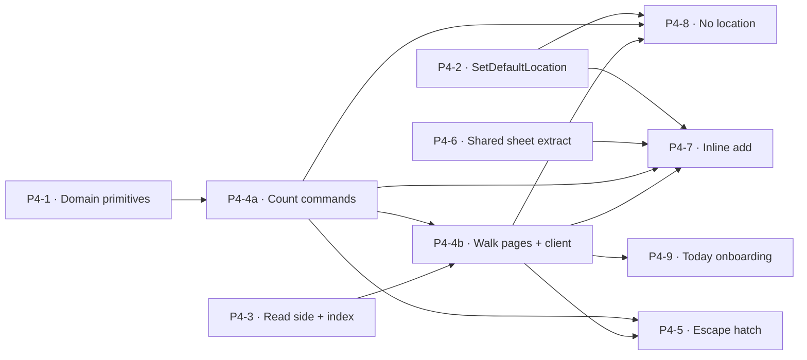

# Plantry — Phase 4 Delivery Plan

> How Phase 4 (**Take Stock** — low-friction inventory reconciliation) gets built: the slices in build
> order and the dependency graph.
> Authority: [VISION.md](VISION.md) (why) · [SPEC.md](SPEC.md) (what) · [ARCHITECTURE.md](ARCHITECTURE.md) (how) · [DataModels/inventory.md](DomainDesign/DataModels/inventory.md) (shape) · [ADRs/](ADRs/index.md) (rationale) · [DomainDesign/Domains/Inventory/inventory-takestock-*](DomainDesign/Domains/Inventory/inventory-takestock-journeys.md) (the Take Stock design). This file holds *sequence*.
>
> Continues [PHASE-3-PLAN.md](PHASE-3-PLAN.md). The build **principles**, **solution structure / dependency rules**, **testing pyramid (L1–L5)**, and **design-system integration** established in Phases 1–3 carry over unchanged — this plan does not restate them, it builds on them.
>
> **Numbering note:** "Phase 4" is the **build-sequence** number (it continues PHASE-3-PLAN). It is *not* VISION's roadmap "Phase 4 — Intelligence Layer." Take Stock is an **Inventory / Pantry** feature (VISION Phase 1 territory) being delivered now.

---

## What Phase 4 is

**Take Stock** — a low-friction flow to walk your storage Locations and reconcile recorded stock
against what is physically on hand, doubling as the **new-user onboarding path** for populating an
empty pantry. Fully designed across the Inventory design docs:
[journeys](DomainDesign/Domains/Inventory/inventory-takestock-journeys.md) →
[ubiquitous language](DomainDesign/Domains/Inventory/inventory-takestock-ubiquitous-language.md) →
[domain model](DomainDesign/Domains/Inventory/inventory-takestock-domain-model.md) →
[data schema](DomainDesign/Domains/Inventory/inventory-takestock-data-schema.md) →
[app services](DomainDesign/Domains/Inventory/inventory-takestock-app-services.md) →
[UI slices](DomainDesign/Domains/Inventory/inventory-takestock-ui-slices.md). This plan turns that
design into code.

**Scope calls for this phase:**

- **No new bounded context, no new schema, no walking skeleton.** Take Stock rides entirely on the
  existing **`ProductStock`** aggregate and journal (TS-1). Unlike Phases 1–3 there is **no `P4-0`
  foundation slice** — tenancy/RLS, migrations, the test harness, and the themed shell already exist.
- **Take Stock is not a new primitive.** Every count is a **`Correction`** (or `Consumed`/`Discarded`)
  journal row on `ProductStock` (TS-1). The only domain changes are two parameters (TS-2/TS-3) and one
  focused Catalog command (TS-9).
- **No resumable session / save-or-lose** (C7). Counts live in page state until Save; leaving discards
  them. No session aggregate, no draft table. Idempotency is set-to-N recompute (TS-7), not a token.
- **One read-side migration only** — `ix_stock_entry_by_location` for the location-walk listing
  (TS-S2). No write-side migration (positive `Correction` and `Manual` source are already legal).
- **Inline product create reuses Recipes' pattern exactly** (C12) — both the anti-corruption write
  port (over Catalog `CreateProductCommand`) and the **shared product-search/create sheet**, which is
  *extracted* from the recipe editor so both consume one control.
- **Counting unit = any unit the product converts to** (C10); reconciliation FEFO is **location-scoped**
  (TS-3). Upward is always a new opening-balance lot (TS-4).
- **Fuzzy add-product search is out of scope** — tracked separately as `plantry-hl4a`.

---

## The slices

Build order top to bottom. Each is independently shippable and pierces the full stack
(Razor page → application service → domain → EF → Postgres → htmx fragment). T-shirt sizes are
sequencing aids, not commitments.

| # | Slice | Journeys | Contexts | Size | Blocks | Status |
|---|---|---|---|---|---|---|
| P4-1 | Domain primitives — upward `Correction` + location-scoped consume | — | Inventory | S | P4-4a, P4-5, P4-7, P4-8 | ⬜ Not started |
| P4-2 | Catalog `SetDefaultLocationCommand` | — | Catalog | S | P4-7, P4-8 | ⬜ Not started |
| P4-3 | Read side — `ITakeStockReader` + location index | J1/J2/J3/J7 | Inventory ↔ Catalog | M | P4-4b, P4-5, P4-7, P4-8 | ⬜ Not started |
| P4-4a | Count commands (scalar) — `RecordCountCommand` + `SaveCountsCommand` | J2/J4 | Inventory | M | P4-4b, P4-5, P4-7, P4-8 | ⬜ Not started |
| P4-4b | Walk pages + working-set client | J1/J2/J4 | Inventory | M | P4-9 | ⬜ Not started |
| P4-5 | Lot escape hatch | J3 | Inventory | M | — | ⬜ Not started |
| P4-6 | Extract shared product-search/create sheet | — | (Recipes UI) | M | P4-7 | ⬜ Not started |
| P4-7 | Inline add (search-or-create during a walk) | J5 | Inventory ↔ Catalog | M | — | ⬜ Not started |
| P4-8 | "No location" section | J7 | Inventory ↔ Catalog | M | — | ⬜ Not started |
| P4-9 | Onboarding entry from Today | J6 | Home (Today) | S | — | ⬜ Not started |

> **Tracker legend:** ✅ Done · 🔄 In progress · ⬜ Not started. Update the Status column as each slice
> lands; this is the single source of truth for "where are we" in Phase 4.

P4-1, P4-2, P4-3, and P4-6 are independent and parallelizable. The critical path is
**P4-1 → P4-4a → P4-4b → (P4-5 / P4-7 / P4-8)**, with P4-3 a co-requisite of P4-4b (the page listing) and
P4-6 a prerequisite of P4-7. P4-5/P4-7/P4-8 extend the P4-4a command seam *and* attach UI to the P4-4b page.

---

### P4-1 — Domain primitives (upward `Correction` + location-scoped consume)

**Goal.** The Inventory aggregate can record a positive `Correction` (found stock / opening balance)
and consume FEFO **within a single Location**.

**Scope.**
- `ProductStock.AddStock` gains `StockReason reason = Purchase`, guarded by a new
  `StockReason.IsAddition()` (true for `Purchase`/`Correction` only). Intake keeps passing `Purchase`;
  Take Stock passes `Correction` (TS-2, C8).
- `ProductStock.Consume` gains `Guid? locationId = null`; when set, the FEFO candidate set filters to
  lots at that Location. `null` preserves today's cross-location behaviour (Cook, manual consume) (TS-3).
- No schema change here (positive `Correction` already CHECK-legal).

**Tests / done-when.** L1: `AddStock(reason: Correction)` writes a positive `Correction` row;
`IsAddition` rejects `Consumed`/`Discarded`; `Consume(locationId)` deducts only in-Location lots, FEFO
order preserved, never touches another Location's lot; existing Cook/consume L1s stay green
(backward-compatible defaults).

**Refs.** inventory-takestock-domain-model.md TS-2/TS-3/TS-4; ProductStock.cs; ADR-011; inventory.md.

---

### P4-2 — Catalog `SetDefaultLocationCommand`

**Goal.** A focused command sets a product's default location without rewriting its other fields.

**Scope.**
- `SetDefaultLocationCommand(productId, locationId)` in `Plantry.Catalog.Application` over the existing
  `Product.SetDefaultLocation`; validates the location exists in the household (reuse
  `ValidateCrossReferences`). Distinct from the field-clobbering `UpdateProductCommand` (TS-9).

**Tests / done-when.** L1/L2: sets default location, leaves name/unit/category/expiry-defaults
untouched; rejects unknown location; RLS-scoped.

**Refs.** inventory-takestock-domain-model.md TS-9; ProductCommands.cs.

---

### P4-3 — Read side (`ITakeStockReader` + location index)

**Goal.** The queries the walk needs: Location list, the per-Location union listing with recorded
counts, lot detail, and product search — backed by a location index.

**Scope.**
- Migration **`ix_stock_entry_by_location`** on `stock_entry (household_id, location_id, product_id)`,
  partial `WHERE depleted_at IS NULL` (TS-S2).
- `ITakeStockReader` (interface + DTOs) in `Inventory.Application`; **`TakeStockReader` adapter in
  `Plantry.Web`** composing the Inventory lot query with Catalog repos directly (TS-10) — **all five
  reader methods** so none is orphaned: `ListLocations`, `ListLocationRows` (the C5 union: lots-here ∪
  defaulted-here-with-none, recorded counts, supported units), `ListNoLocationRows` (the J7 unassigned
  set: tracked, non-parent, non-archived products with no default location and no active lots — consumed
  by P4-8), `ListLots` (escape hatch), `SearchProducts` (exact/contains; fuzzy = `plantry-hl4a`).

**Tests / done-when.** L3: index applies clean in CI; the union listing returns both branches with
correct per-(product, Location) recorded sums; RLS isolation. L2: reader composition over faked
Catalog/Inventory reads.

**Refs.** inventory-takestock-app-services.md (`ITakeStockReader`); data-schema TS-S2; C5/C10.

---

### P4-4a — Count commands (scalar)

**Goal.** The application seam that turns a counted value into journal rows — **no UI**. (J2/J4)

**Scope.**
- `RecordCountCommand` (per-item set-to-N): load `ProductStock` `FOR UPDATE`; recompute the recorded
  sum **at the Location** from the aggregate's active lots, each converted to the counted unit via the
  product converter (TS-5); `delta = counted − recorded`; dispatch `AddStock`(+, `reason: Correction`) /
  `Consume`(−, `locationId`) / no-op. Idempotent on re-drive (recompute against current ⇒ an applied
  item yields delta 0 — TS-7). `source_type = Manual`.
- `SaveCountsCommand` (batch): **N independent per-aggregate transactions** (not one global tx — TS-6),
  returning a per-item result vector for partial success.
- **Does not depend on P4-3** — `RecordCount` reads the recorded sum from the loaded aggregate, not the
  reader. Depends only on the P4-1 domain primitives (+ the existing repo / `IProductConversionProvider`).

**Tests / done-when.** L2: `RecordCount` up / down / no-op; per-lot-unit conversion into the counted
unit; set-to-N idempotency on re-drive; `SaveCounts` partial-success vector (one failing item does not
roll back the rest). No UI in this slice.

**Refs.** app-services (`RecordCountCommand` / `SaveCountsCommand`); domain-model TS-5/TS-6/TS-7;
StockCommands.cs (the `ExecuteInTransactionAsync` pattern). Depends on P4-1.

---

### P4-4b — Walk pages + working-set client

**Goal.** Pick a Location, see every belonging product with its recorded count, type actual counts in
any supported unit, and Save — the UI on top of the P4-4a commands. (J1/J2/J4)

**Scope.**
- Pages `/pantry/take-stock` (Location list, J1) and `/pantry/take-stock/{locationId}` (walk, J2):
  count rows with **stepper** input + **unit selector** (C10) + one-tap "none left", the row-level
  **reason selector** (default Correction; "Used it"/"Spoiled" → Consumed/Discarded — C9), a sticky
  Save bar wired to `SaveCountsCommand` (P4-4a). Row listing from `ITakeStockReader.ListLocationRows`
  (P4-3).
- **Working-set client model** in Alpine (page-only, dirty tracking) with the **"leave page?" guard**
  on unsaved counts (C7). Reuse-first against the Dev library; no new shared component here.

**Tests / done-when.** L4: Location-list + walk + Save fragments. L5: open a Location → change a count →
Save → journal reflects it; leave with unsaved counts → guard fires; re-Save no-ops applied items;
partial-failure rows re-flag inline.

**Refs.** ui-slices (working set, C7); journeys J1/J2/J4. Depends on P4-4a, P4-3.

---

### P4-5 — Lot escape hatch

**Goal.** Expand a multi-lot product to adjust individual lots — per-lot reduce (with "spoiled"),
or add found stock with an expiry. (J3)

**Scope.**
- Escape-hatch payload in `SaveCountsCommand`: per-lot `Consume(targetEntry, reason)` for reductions
  (with a "spoiled" → `Discarded` toggle), `AddStock(reason: Correction, expiry)` for found stock
  (TS-4). `ListLots` (P4-3) feeds the panel.
- UI: expandable lot list on a count row (reuse the `_StockDetail` lot pattern); per-lot qty inputs,
  spoiled toggle, "add found stock" with optional expiry; collapse rolls the total back to the scalar.

**Tests / done-when.** L2: per-lot reduce writes a lot-scoped removal; spoiled → `Discarded`; found →
positive `Correction` lot with the given expiry. L4: lot panel fragment. L5: expand → adjust two lots →
Save → each lot reflects its change.

**Refs.** journeys J3; domain-model TS-4/C9; app-services (escape-hatch payload).

---

### P4-6 — Extract shared product-search/create sheet

**Goal.** The recipe editor's product-search + inline-create sheet becomes a **shared component** both
Recipes and Take Stock consume (C12) — *not* cloned.

**Scope.**
- Extract the add/edit sheet (the `searchableSelect` picker + its "create new" mode) from
  `Pages/Recipes/Edit.cshtml` into a shared component registered in the Dev component library.
- **Pin the component API at plan time** (not discovered mid-implementation): the props —
  `trackStock` (bool), the host extra-fields slot (Recipes: qty/unit/group-heading; Take Stock:
  count/location), and the search → no-match → create state toggle + the create/select event contract.

**Risk (call out in the ticket).** `Pages/Recipes/Edit.cshtml` is a **~536-line churn hotspot** and
carries the known Alpine **`@click="var …"` gotcha** — a handler expression starting with `var` silently
no-ops the whole handler (bd memory `alpine-event-handler-var-token-syntax-error`; use `let`/`const`).
The extraction must be **strictly behaviour-preserving**: the existing recipe create/edit **and**
inline-staple **L5s staying green is a hard gate** on this slice.

**Tests / done-when.** L4: shared-sheet fragment in isolation. L5: the **existing** recipe
create/edit + inline-staple flows still pass unchanged; the component renders in the Dev library.

**Refs.** ui-slices ("the one shared new component"); C12; `.claude/CLAUDE.md` component-library rule;
Recipes `ICatalogWriter`/`CatalogWriterAdapter`.

---

### P4-7 — Inline add (search-or-create during a walk)

**Goal.** "+ Add item" finds an existing product or creates a new tracked one inline, then counts it. (J5)

**Scope.**
- `ITakeStockCatalogWriter` (port in `Inventory.Application`) + `TakeStockCatalogWriter` adapter in
  `Plantry.Web` over Catalog `CreateProductCommand(trackStock: true, defaultLocationId: L)` and
  `SetDefaultLocationCommand` — the exact analogue of Recipes' `ICatalogWriter` (TS-8, C12).
- `AddCountedItemCommand` composing create → `RecordCount` opening balance (C8).
- Consume the **shared sheet** (P4-6) wrapped with count + (current) location; search-first dedupe;
  duplicate-name surfaced inline.

**Tests / done-when.** L2: create-then-count writes a tracked product + opening-balance `Correction`;
duplicate name surfaces Catalog's error. L5: add a brand-new item in a Location → Save → it appears
with stock; adding an existing match reuses it (no duplicate).

**Refs.** journeys J5; app-services (`ITakeStockCatalogWriter`/`AddCountedItemCommand`); C12/C8;
depends on P4-6.

---

### P4-8 — "No location" section

**Goal.** Tracked products with neither lots nor a default location surface in a dedicated section and
are counted by assigning a location inline. (J7)

**Scope.**
- `ListNoLocationRowsAsync` (P4-3) feeds `/pantry/take-stock/no-location`: same row shape as the walk
  plus a **required location picker** per row. Saving writes the opening balance in the chosen Location
  **and** calls `SetDefaultLocationAsync` (P4-2) so the item is placed for future walks. A 0-count with
  a chosen location is a pure "file this product" (default location set, no lot) (J7 edge).

**Tests / done-when.** L2: count + location → opening-balance lot in that Location + default location
set; 0-count + location → default location only, no lot; no-location → row leaves the list. L5: file an
imported unplaced product → it leaves the section and appears under its Location.

**Refs.** journeys J7; app-services; C5/TS-9; depends on P4-2, P4-4a, P4-4b.

---

### P4-9 — Onboarding entry from Today

**Goal.** A new/near-empty household is guided from Today into Take Stock to populate the pantry. (J6)

**Scope.**
- A cold-start CTA on **Today** ("Stock your pantry — Take Stock") shown when tracked stock is
  little/none; deep-links to `/pantry/take-stock`. Recedes once stock exists. A **Home (Today)**
  context change composing existing cold-start machinery — not Inventory UI.

**Tests / done-when.** L4: the Today CTA fragment under the empty-stock condition. L5: a fresh household
sees the CTA → lands in the additive walk; after adding stock the CTA is gone.

**Refs.** journeys J6; Home (Today) cold-start; depends on P4-4b existing.

---

## Dependency graph

The critical path is **P4-1 → P4-4a → P4-4b → {P4-5, P4-7, P4-8}**. P4-3 is a co-requisite of P4-4b (the
page listing); P4-4a (the command seam) is what P4-5/P4-7/P4-8 extend, while they attach UI to P4-4b.
P4-2 and P4-6 are independent and feed P4-7/P4-8; P4-9 hangs off a working P4-4b.

---

## Reuse from earlier phases

- **`ProductStock` / `Consume` / `AddStock`** — the Phase-1 Inventory aggregate; Take Stock writes only
  its existing `Correction`/`Consumed`/`Discarded` journal rows (ADR-011).
- **`ICatalogReadFacade` / Catalog repos** — product/location/unit reference data for the listings.
- **Recipes' `ICatalogWriter` pattern** — the anti-corruption write-port + Web-adapter seam, mirrored
  by `ITakeStockCatalogWriter`; and the recipe editor's product-search/create sheet, *extracted* for
  shared use (P4-6).
- **`searchableSelect`, steppers, segmented controls, sheets** — Dev-library primitives; reuse-first per
  `.claude/CLAUDE.md`.
- **RLS / migrations pipeline / L1–L5 test harness / themed shell** — all from Phases 1–3; no new
  foundation.

---

## Suggested first move

Land **P4-1** (domain primitives) and **P4-3** (read side + index) in parallel — they unblock
everything and carry the only schema change. Then **P4-4a** (count commands) and **P4-4b** (the walk
pages on top) to make a Location hand-countable end to end. From there, **P4-5** (escape hatch),
**P4-7** (inline add, after the **P4-6** sheet extraction), and **P4-8** ("No location") fan out, with
**P4-9** (Today onboarding) once the walk page exists. Pull **P4-2** and **P4-6** in parallel whenever
there's slack — both are independent prerequisites.
