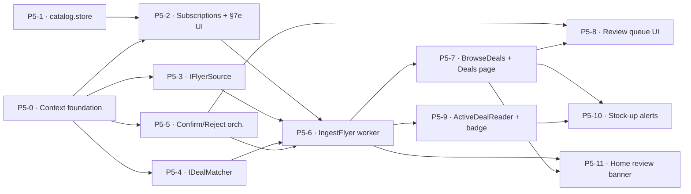

# Plantry — Phase 5 Delivery Plan

> How Phase 5 (**Deals** — flyer ingestion, review-then-commit, and deal-aware pricing) gets built: the
> slices in build order and the dependency graph.
> Authority: [VISION.md](VISION.md) (why) · [SPEC.md](SPEC.md) (what — §6 Deals, §7e Stores & Deals, §3f deal badge, §0b review banner) · [ARCHITECTURE.md](ARCHITECTURE.md) (how) · [DataModels/deals.md](DomainDesign/DataModels/deals.md) + [DataModels/catalog.md](DomainDesign/DataModels/catalog.md) (shape) · [ADRs/](ADRs/index.md) (rationale, esp. ADR-007 untrusted-source ACL, ADR-008 RLS, ADR-010 Deals + its Phase-5 amendment) · [DomainDesign/Domains/Deals/deals-*](DomainDesign/Domains/Deals/deals-journeys.md) (journeys → ubiquitous language → domain model). This file holds *sequence*.
>
> Continues [PHASE-4-PLAN.md](PHASE-4-PLAN.md). The build **principles**, **solution structure / dependency rules**, **testing pyramid (L1–L5)**, and **design-system integration** established in Phases 1–4 carry over unchanged — this plan does not restate them, it builds on them.
>
> **Numbering note:** "Phase 5" is the **build-sequence** number (it continues PHASE-4-PLAN: P1 Pantry+Intake · P2 Recipes · P3 Meal Planning · P4 Take Stock · **P5 Deals**). Older docs that numbered Deals earlier (Phase 3, then Phase 4 before Take Stock was injected) are reconciled in the [ADR-010](ADRs/ADR-010.md) amendment 2026-06-22.

---

## What Phase 5 is

**Deals** — a background pull of each subscribed store's flyer (Flipp, via an untrusted/fragile
adapter), normalized and matched against the catalog, then **reviewed-then-committed** so confirmed
deals become `pricing.price_observation` rows. Match memory auto-confirms known repeats so steady-state
review is just the *new* items. Fully designed across the Deals design docs:
[journeys](DomainDesign/Domains/Deals/deals-journeys.md) →
[ubiquitous language](DomainDesign/Domains/Deals/deals-ubiquitous-language.md) →
[domain model](DomainDesign/Domains/Deals/deals-domain-model.md) →
[data schema](DomainDesign/DataModels/deals.md). Per the established sequence the **App Services** and
**UI Slices** detail is folded into the slices below (each slice pierces the full stack), rather than
written as separate docs. This plan turns that design into code.

**Scope calls for this phase:**

- **A new bounded context with a new schema — so there *is* a `P5-0` foundation slice** (unlike P4's
  Take Stock, which rode the existing `ProductStock` aggregate). `P5-0` stands up the
  `Plantry.Deals` + `Plantry.Deals.Infrastructure` projects, `DealsDbContext`, the `deals` schema
  migration (four tables), strongly-typed IDs, the four aggregates, and the pure `DealNormalizer`.
  **RLS gotcha:** the new `DealsDbContext` **must** be registered in
  [`RlsMiddleware`](../src/Plantry.Web/Tenancy/RlsMiddleware.cs) or reads silently return nothing (the
  Recipes P2-1 / Meal Planning P3 trap — [deals.md](DomainDesign/DataModels/deals.md) RLS note).
- **The ACL is the *persisted* Intake shape, not Meal Planning's transient store** (D2). The raw pull
  is quarantined in `flyer_import.raw_flyer` (jsonb, write-once); only **user-confirmed or
  memory-auto-confirmed** deals cross into Pricing (D5). Flyer review is async and spread over time, so
  staging is durable — `flyer_import` + `deal` mirror `intake.import_session`/`import_receipt`.
- **Four flat aggregates, none a child of another** (DL-O1/O2). `Deal` is its **own** long-lived root
  (browsed while active, feeding Pricing across its window, expiring on its own clock), referencing its
  `FlyerImport` by a within-context composite FK (`(household_id, flyer_import_id)`, RESTRICT; nullable
  for the deferred manual path, D12).
- **The human is the trust boundary** (ADR-007). AI `MatchConfidence` (`high`/`low`/`none`, reused from
  Intake DM-15) shapes review *treatment* only; **only `DealMatchMemory`** — a prior human decision —
  auto-confirms. Auto-matched deals stay Correctable/Rejectable; a correction rewrites memory and
  **supersedes** the observation (Pricing append-only, never edited).
- **Costing goes through Pricing — the seam is *designed*, not yet *built*** (D6 / ADR-010). ADR-010/DM-17
  specify the target: `pricing.price_observation` carries `source=deal` + a nullable validity window +
  `store_id`, and "cheapest active deal" is a **Pricing** read model Recipes/Meal-Planning/Shopping
  consume — so no consumer ever reads Deals (the boundary payoff: a clean star around Pricing). But the
  code never built the deal columns/read models. **P5-P builds them** (window + `store_id` + source-filtered
  reads); **P5-9 / P5-9b wire the consumers** (Shopping badge, recipe/meal-plan cost). The invariant that
  holds regardless: **no Deals port** — Deals is a pure writer into Pricing (DJ6). *(Earlier drafts said
  "pre-built / no change to those contexts" — that was tense, not architecture; corrected here and in the
  beads.)*
- **`catalog.store` lands this phase** (Catalog-owned reference data, DM-16) — the target of every
  `store_id` soft-ref and the home of the §7e merchant-management UI. Its arrival closes the DM-16
  deferral (`price_observation.store_id` now populated for deal observations, back-fillable for
  historical purchases).
- **Reuses, not rebuilds:** the `IShoppingListWriter` P2-4 seam (Shopping, DM-18) **already exists**; the
  `IPriceObservationWriter`/`RecordObservation` seam (Pricing, DM-17) exists but is **extended in P5-P**
  with the deal window + `store_id` + read models (the DM-17 design that was never built); `IDealMatcher`
  wraps the AI key exactly as
  Intake wraps its `ChatClient` (DM-7); the review form is the **Intake review form's twin** (§2e) and
  reuses the shared product-search/create sheet extracted in P4-6.
- **Deferred / out of scope (v1):** manual deal entry (D12 — model leaves room via nullable
  `flyer_import_id` + `source` discriminator, not built); push notification of alerts (D10 — needs PWA
  install, in-app only in v1); auto-supersede on flyer reprice of an already-resolved deal (DD13 — left
  as-is, behind a future content-churn telemetry trigger).

---

## The slices

Build order top to bottom. Each is independently shippable and pierces the full stack (Razor page →
application service → domain → EF → Postgres → htmx fragment) except the explicitly backend-only and
worker slices. T-shirt sizes are sequencing aids, not commitments.

| # | Slice | Journeys | Contexts | Size | Blocks |
|---|---|---|---|---|---|
| P5-0 | Deals context foundation — projects, `DealsDbContext`, `deals` migration, 4 aggregates, `DealNormalizer` | — | Deals | L | all |
| P5-1 | Catalog `store` reference data (DM-16) — table + `Store` + commands + reader/writer | — | Catalog | S | P5-2 |
| P5-P | Pricing deal support (DM-17) — `price_observation` window + `store_id`, `RecordObservation(source=deal)`, cheapest-active-deal + effective-price read models (the DM-17 design, built) | — | Pricing | M | P5-5, P5-9, P5-9b |
| P5-2 | Store subscriptions + §7e management UI (DJ1) | DJ1 | Deals ↔ Catalog | M | P5-6 |
| P5-3 | `IFlyerSource` adapter — the Flipp ACL (the fragile seam) | DJ2 | Deals.Infra | M | P5-6 |
| P5-4 | `IDealMatcher` adapter — untrusted AI match (household AI key) | DJ2 | Deals.Infra | M | P5-6 |
| P5-5 | Confirm/Correct/Reject orchestration — `ConfirmDeal`/`RejectDeal` + Pricing seam (no UI) | DJ4 | Deals ↔ Pricing | M | P5-6, P5-8 |
| P5-6 | `IngestFlyer` worker — pull → normalize → match → materialize (DJ2) | DJ2 | Deals | L | P5-7, P5-11 |
| P5-7 | `BrowseDeals` read side + Deals page (DJ3) | DJ3 | Deals ↔ Catalog | M | P5-8, P5-10, P5-11 |
| P5-8 | Review queue UI — Confirm/Correct/Reject form (DJ4) | DJ4 | Deals ↔ Catalog | M | — |
| P5-9 | Shopping deal badge over Pricing's cheapest-active-deal read model (DJ6/D11) | DJ6 | Shopping → Pricing | M | — |
| P5-10 | Stock-up alerts — read model + "add to list" (DJ5) | DJ5 | Deals ↔ Inventory/Shopping | M | — |
| P5-11 | Home (Today) deal review banner (`plantry-bpw`) | DJ4 | Home (Today) | S | — |

> **Status / tracking:** beads are the single source of truth — this epic's slices are `bd` issues under
> the Phase 5 — Deals epic (`plantry-6yoz`). Run `bd ready` / `bd show <id>` for live status; this plan
> holds *sequence and scope*, not progress. `P5-11` is the re-homed `plantry-bpw`.

`P5-1`, `P5-3`, and `P5-4` are independent of each other and parallelizable once `P5-0` lands. The
critical path is **P5-0 → {P5-3, P5-4, P5-5} → P5-6 → P5-7 → P5-8**. `P5-9`, `P5-10`, and `P5-11` hang
off the read side / a working ingest and fan out last.

---

### P5-0 — Deals context foundation (walking skeleton)

**Goal.** A new `deals` bounded context exists end to end: projects, DbContext, schema, the four
aggregates with their behaviours, and the pure normalizer — RLS-correct, migration-clean, L1-covered.
No app services, no UI.

**Scope.**
- New `Plantry.Deals` (Domain) + `Plantry.Deals.Infrastructure` projects, mirroring the
  `Plantry.MealPlanning` / `Plantry.Intake` layout and dependency rules.
- Strongly-typed IDs (`StoreSubscriptionId`, `FlyerImportId`, `DealId`, `DealMatchMemoryId`) and the
  value objects / enums: `MatchConfidence` (`High`/`Low`/`None`), `DealStatus`
  (`Pending`/`Confirmed`/`Rejected`), `DealSource` (`flyer`/`manual`), `PullStatus`
  (`Pulling`/`Parsed`/`Failed`), `ValidityWindow` (`ValidFrom`/`ValidTo`).
- The four aggregate roots with the §3–§6 behaviours: `StoreSubscription`
  (`Subscribe`/`Pause`/`Resume`/`Unsubscribe`/`RecordPull`); `FlyerImport`
  (`Start`/`MarkParsed`/`MarkFailed`, `raw_flyer` set-once); `Deal`
  (`Stage`/`AutoConfirm`/`Confirm`/`Correct`/`Reject`/`LinkObservation`); `DealMatchMemory`
  (`Remember`/`RememberNegative`/`Repoint`/`Forget`). `IClock`-stamped mutators, `Result<T>`/`Error`
  for failable ops — the established aggregate pattern.
- `DealNormalizer` (domain, pure): `Normalize(rawName) → NormalizedName` (lowercase, trim, strip
  pack-size/unit/punctuation), with a `NormalizerVersion` constant (DD4/DL-O6). No I/O, no AI.
- `DealsDbContext` + EF configs for the four `deals` tables; the `deals` schema migration (all columns,
  CHECKs, the `(household_id, store_id, flyer_external_id)` / `(household_id, store_id, normalized_name)`
  / `(household_id, store_id)` uniques, the `(household_id, flyer_import_id)` composite FK, per-household
  RLS policies — ADR-008 / conventions.md).
- **Register `DealsDbContext` in `RlsMiddleware.InvokeAsync`** (the known gotcha) and in DI.

**Tests / done-when.** L1: every aggregate behaviour (status transitions, set-once `raw_flyer`,
monotonic `PullStatus`, `valid_from <= valid_to`, `DealNormalizer` determinism across inputs +
version stamp). L3: migration applies clean in CI; RLS isolates by household (a second household sees
no rows). Solution builds; no app services or pages yet.

**Refs.** deals-domain-model.md §2–§7; deals.md (all four tables + RLS note); ADR-007/008/010;
`RlsMiddleware.cs`; `Plantry.MealPlanning` project layout.

---

### P5-1 — Catalog `store` reference data (DM-16)

**Goal.** The merchant-identity reference table lands, Catalog-owned, with the commands and read/write
ports Deals needs to resolve and ensure a store by ID.

**Scope.**
- `catalog.store` table + `Store` entity/aggregate in Catalog (same shape as `Location`/`Unit`/
  `Category` — household-scoped reference data, RLS); migration in [catalog.md](DomainDesign/DataModels/catalog.md).
- `CreateStoreCommand` / `EnsureStoreCommand` (idempotent ensure-by-external-identity, used on
  subscribe) and a `IStoreReader` over the household's stores.
- `price_observation.store_id` becomes populatable for deal observations (closes the DM-16 deferral) —
  no Pricing write here, just the reference target existing.

**Tests / done-when.** L1/L2: create/ensure a store (idempotent — re-ensure reuses the row); RLS-scoped;
read by id and list. L3: migration applies clean.

**Refs.** catalog.md (DM-16 `store`); deals-ubiquitous-language.md N1/D7; conventions.md reference-data
pattern.

---

### P5-2 — Store subscriptions + §7e management UI (DJ1)

**Goal.** A household can search Flipp's store directory, subscribe to a merchant, pause/unsubscribe,
and see last-pull status — Settings → Stores & Deals (§7e).

**Scope.**
- `ManageSubscriptions` app service (DJ1): `Subscribe` (ensures the `catalog.store` row via the P5-1
  ensure-command, then creates the `StoreSubscription`), `Pause`/`Resume`, `Unsubscribe` (soft).
- Ports + Web adapters: `ICatalogStoreReader`/`ICatalogStoreWriter` (over P5-1); store-directory search
  via `IFlyerSource` (the directory half — a **stub adapter is acceptable here** and replaced/extended
  by P5-3's real pull adapter).
- §7e UI: subscription list with last-pulled status, store-search + subscribe, pause/unsubscribe.
  Reuse-first against the Dev component library.

**Tests / done-when.** L2: subscribe ensures store + creates subscription (unique per household+store);
re-subscribe to a removed store reuses the row and its match memory; pause/unsubscribe soft-deactivate.
L4/L5: the Stores & Deals page — search → subscribe → it appears; unsubscribe removes it from active.

**Refs.** journeys DJ1; deals-domain-model.md §3, §7 (`ManageSubscriptions`), §8 ports;
`ICatalogStore*`. Depends on P5-1.

---

### P5-3 — `IFlyerSource` adapter (the Flipp ACL — the fragile seam)

**Goal.** The untrusted external feed is wrapped behind an adapter that yields normalized `RawDeal`s —
the domain never sees a Flipp DTO. The single brittle seam, isolated in Infrastructure (D1).

**Scope.**
- `IFlyerSource` (port in `Plantry.Deals.Application`): pull a store's current flyer →
  `RawDeal[]` + `(flyer_external_id, ValidityWindow, content)`; search the store directory.
- `FlyerSource` adapter in `Plantry.Deals.Infrastructure` over Flipp's unofficial API/scraper — all
  Flipp-shape knowledge contained here; returns trust-by-shape `RawDeal`s. Resilient to source failure
  (surfaces as a `FlyerImport.Failed`, handled in P5-6).

**Tests / done-when.** L2: a recorded/fixture flyer payload maps to the expected `RawDeal[]` + window +
external id + content hash input; a malformed/empty payload degrades safely (no throw into the domain).
Live-pull smoke is manual/optional (fragile source).

**Refs.** journeys DJ2 step 1; deals-domain-model.md §8 (`IFlyerSource`); ADR-007/010; cross-cutting
notes (the brittle seam). Depends on P5-0.

---

### P5-4 — `IDealMatcher` adapter (untrusted AI match)

**Goal.** Stage-2 matching: resolve a `RawDeal` to a candidate `catalog.product` with a confidence and
reasoning — the untrusted AI step, quarantined, never trusted to commit.

**Scope.**
- `IDealMatcher` (port): `(RawDeal, candidate products) → (suggested_product_id, MatchConfidence,
  reasoning)`.
- `DealMatcher` adapter in `Plantry.Deals.Infrastructure` over `ChatClient` + the **household AI key**
  (DM-7, encrypted, never client-sent) — the exact pattern as Intake's matcher. Candidate products via
  `ICatalogProductReader` (search).
- Output lands only in the `suggested_*`/`match_confidence`/`match_reasoning` quarantine columns
  (write-once, DD6) — it never sets `product_id`.

**Tests / done-when.** L2: deterministic mapping of a faked `ChatClient` response to a match proposal;
`high`/`low`/`none` confidence preserved; reasoning captured; no `product_id` ever written here.

**Refs.** journeys DJ2 step 4 / D3; deals-domain-model.md §8 (`IDealMatcher`); Intake's matcher;
ADR-007; DM-7. Depends on P5-0.

---

### P5-5 — Confirm/Correct/Reject orchestration (DJ4 backend, no UI)

**Goal.** The commit seam: flip a deal's state and run the cross-aggregate side effects as **separate
transactions** (Intake's resumable-commit discipline). Shared by the review UI (P5-8) *and* auto-confirm
(P5-6).

**Scope.**
- `ConfirmDeal` app service: `Deal.Confirm`/`AutoConfirm`/`Correct` → then, each in its own transaction:
  (1) **upsert `DealMatchMemory`** `(store, normalized_name) → product`; (2) `IPriceObservationWriter.
  RecordObservation(source=deal, price, quantity, unit, valid_from, valid_to, store_id,
  source_ref=deal_id)` → `Deal.LinkObservation`. A **Correct** on an already-confirmed deal
  **supersedes** with a new observation (append-only, never edited — DM-17/R1) and **Repoints** memory.
  Re-drive confirms only what isn't yet linked (`committed_price_observation_id` null) — DD2.
- `RejectDeal` app service: `Deal.Reject`; optional `DealMatchMemory.RememberNegative` (DL-O3); writes
  no observation.
- Reuse the `IPriceObservationWriter` seam (Pricing, DM-17) — **extended in P5-P** with the deal window +
  `store_id` + read models (the Pricing work the "pre-built" framing wrongly assumed done); P5-5 is the
  Deals-side adapter wiring over it. Writes one `price_observation` (`source=deal`), **not** a separate
  table. `ICatalogProductReader` for product validation.
- Emits `DealConfirmed` / `DealRejected` domain events.

**Tests / done-when.** L2: confirm writes exactly one observation + upserts memory + links it; correct
on a confirmed deal supersedes (new observation, memory repointed); reject writes no observation +
optional negative memory; **mid-confirm failure never double-writes** (re-drive links only the missing
piece). Past-window confirm still writes (backfill, DD14). No UI.

**Refs.** journeys DJ4; deals-domain-model.md §7 (`ConfirmDeal`/`RejectDeal`), §10 (DD1/DD2/DD11/DD14);
deals.md resolved-call 5; Intake commit orchestration; `IPriceObservationWriter`. Depends on P5-0.

---

### P5-6 — `IngestFlyer` worker (DJ2)

**Goal.** The async ingestion pipeline: per active subscription, pull → dedup → normalize → match →
materialize deals, auto-confirming remembered matches and queuing the rest. The heart of the context.

**Scope.**
- `IngestFlyer` app service / hosted worker (async, no user present — like the email-intake processor):
  for each `is_active` `StoreSubscription` — pull via `IFlyerSource` (P5-3); **dedup** on
  `(household, store, flyer_external_id)` + `content_hash` (unchanged ⇒ no-op, DD5); create/update a
  `FlyerImport` with `raw_flyer` quarantined; **stage 1** `RawDeal`s + `DealNormalizer`; **stage 2**
  match — `DealMatchMemory` lookup first, else `IDealMatcher` (P5-4); materialize a `Deal` per `RawDeal`
  (remembered → `AutoConfirm` → the **P5-5 confirm side effects**; rest → `Pending`); on a re-pull
  refresh **only still-`Pending`** deals, freeze `Confirmed`/`Rejected` (DD13); `MarkParsed`; emit
  `FlyerImported(pendingCount)`. On pull failure → `MarkFailed(error)`, retry next cycle.
- Worker scheduling/registration (mirror the existing background-processor pattern).

**Tests / done-when.** L2: full pipeline over faked `IFlyerSource`/`IDealMatcher` — remembered item
auto-confirms (+ observation written via P5-5); unremembered lands `Pending` with the proposal; re-pull
is idempotent (no duplicate `FlyerImport`/`Deal`; only `Pending` refreshed; resolved frozen); a source
failure marks the import `Failed` with `error_detail` and writes no partial deals. L3: dedup uniques
hold under a real re-pull.

**Refs.** journeys DJ2; deals-domain-model.md §7 (`IngestFlyer`), §10 (DD5/DD6/DD12/DD13);
deals.md resolved-calls 3. Depends on P5-3, P5-4, P5-5.

---

### P5-7 — `BrowseDeals` read side + Deals page (DJ3)

**Goal.** The Deals page (§6a): active deals (confirmed ∧ in-window) with product names and the
auto-matched marker, plus the pending review section — and the read model behind them.

**Scope.**
- `BrowseDeals` read service: active deals (`Confirmed` ∧ in-window, DD7) and the **pending queue**
  (`Pending` ∧ in-window — expired-unreviewed drops off, DD14), product names via `ICatalogProductReader`.
- Deals page UI (§6a / DJ3): active list grouped/sorted (store or category), per-deal store/price/
  "valid until", auto-matched marker (DL-O3), a visually distinguished pending section with a **Review**
  entry into P5-8, and an empty state inviting subscription (DJ1). Reuse-first against the Dev library.

**Tests / done-when.** L2: active vs pending partition against the clock (in-window predicate);
auto-matched flag surfaced; product names resolved. L4/L5: the Deals page renders active + pending,
auto-matched marker shows, empty-state when no deals.

**Refs.** journeys DJ3; deals-domain-model.md §7 (`BrowseDeals`), §10 (DD7/DD14); deals.md read models.
Depends on P5-6 (data to browse) — may develop against seeded deals.

---

### P5-8 — Review queue UI — Confirm/Correct/Reject form (DJ4)

**Goal.** The deal-side twin of the Intake review form (§2e/§6b): work the pending queue with the three
verbs, confidence-shaped treatment, catalog search, and inline product create.

**Scope.**
- Review form: pending deals with raw name/brand/price/`SaleStory`/window and the AI proposal —
  `high` pre-filled, `low` flagged, `none`/"Unrecognized" (DL-O7); the **Confirm / Correct / Reject**
  verbs wired to the P5-5 commands. Correct = catalog search + AI "did you mean" chip (reuse the Intake
  chip pattern); **inline create-product** reuses the **shared product-search/create sheet** (extracted
  in P4-6) / the Intake §2d flow. Auto-matched (already-confirmed) deals are Correctable/Rejectable from
  here too (DJ3 → DJ4 edge).
- Queue shrinks as it's worked; empty-state clears the entry and (with P5-11) the Home banner.

**Tests / done-when.** L4: review-form fragment with each confidence treatment. L5: confirm a proposed
match → it leaves the queue and becomes active; correct via search → resolves a different product +
rewrites memory; reject → leaves the queue, no observation; inline-create → confirm against the new
product.

**Refs.** journeys DJ4; deals-domain-model.md §7; SPEC §6b / §2e (Intake review twin); P4-6 shared sheet;
Intake §2d inline create. Depends on P5-5, P5-7.

---

### P5-9 — Shopping deal badge over Pricing's cheapest-active-deal read model (DJ6/D11)

**Goal.** Shopping renders a deal badge on list items at read time — never stored (D11). Per **ADR-010**
the "active deal per product" read model lives in **Pricing**, so Shopping reads **Pricing, not Deals**.

**Scope.**
- Shopping consumes **Pricing's cheapest-active-deal read model** (built in P5-P) at read time for the
  §3a/§3f badge ("On sale at FreshCo this week", tappable to the deal) — a Shopping-side adapter over
  Pricing, same pattern as the recipe cost badge reading Pricing. Store name via `ICatalogStoreReader`;
  never stored.
- **No exposed Deals reader** (ADR-010 boundary): Deals is a pure writer into Pricing. Deals' *own*
  surfaces — the Deals page (§6a, P5-7) and stock-up alerts (P5-10) — read the `deal` table in-context.
- Deal-aware recipe cost (SPEC §4) and the Meal Planning `Deals` lever are **not** free: the read model
  is built in P5-P and the consumers are wired in **P5-9b** (the C7 deal-blind adapters un-pinned).

**Tests / done-when.** L4/L5: a shopping-list item whose product has an active deal shows the badge;
it disappears when the window lapses. Shopping reads Pricing's read model, never Deals.

**Refs.** journeys DJ6; ADR-010 (Pricing owns the read model; Shopping reads Pricing, not Deals); pricing.md cheapest-active-deal; D11/DM-18; Shopping
list (§3f). Depends on P5-6.

---

### P5-10 — Stock-up alerts (DJ5)

**Goal.** Frequently-bought products that have an active deal surface as alerts; tapping adds to the
shopping list via the reused P2-4 seam.

**Scope.**
- `StockUpAlerts.Compute()` read model: `IPurchaseFrequencyReader` ∩ active deals (D10/§6c) — carries
  the product, the cheapest active deal's store + price, and the window; recomputed, never stored.
- **Resolve DL-O4 here:** `IPurchaseFrequencyReader` reads **Inventory's `Purchase`-journal rows** (the
  lean, truest "what we actually buy") — port in Deals, adapter in Web over Inventory.
- "Add to shopping list" → `IShoppingListWriter.AddItems(product_id, qty, unit, source="deal",
  source_ref=deal_id)` — the **P2-4 seam, reused** (DM-18); Shopping applies its merge rule (no dup).
- UI: alert surface on the Deals page (banner/badge).

**Tests / done-when.** L2: the intersection (frequent ∩ active-deal) — frequent-without-deal yields no
alert; "add to list" calls the seam with `source="deal"`; an already-listed item merges (no dup). L4/L5:
an alert renders on the Deals page and "Add to list" places it (with the deal badge from P5-9).

**Refs.** journeys DJ5; deals-domain-model.md §7 (`StockUpAlerts`), §8 (`IPurchaseFrequencyReader`,
`IShoppingListWriter`); DL-O4 resolution; P2-4 `AddItems`. Depends on P5-7, P5-9.

---

### P5-11 — Home (Today) deal review banner (`plantry-bpw`)

**Goal.** A "N deals ready to review" banner on Home routes into the review queue (DJ4) — the standing
async-review entry point (§0b).

**Scope.**
- The banner renders via the **kind-keyed banner stack** already built on Home (`plantry-yb6`); it is
  Deals-phase work that happens to render on Home (the Home design is complete).
- **Recount against the clock** (`Pending` ∧ in-window, DD14) via `BrowseDeals` — **not** the
  point-in-time `FlyerImported.pendingCount`, or a week-old event keeps advertising expired deals
  (deals.md banner note). Deep-links to the P5-8 review queue; clears when the queue empties.

**Tests / done-when.** L4: the banner fragment under a non-zero in-window pending count. L5: with pending
in-window deals the banner shows and links to review; after clearing the queue it's gone; an
all-expired pending set shows no banner.

**Refs.** journeys DJ4 trigger / SPEC §0b; deals.md read-models banner note; `plantry-yb6` banner stack;
`BrowseDeals` (P5-7). Re-homed `plantry-bpw`. Depends on P5-6, P5-7.

---

## Dependency graph

The critical path is **P5-0 → {P5-3, P5-4, P5-5} → P5-6 → P5-7 → P5-8**. `P5-1`/`P5-2` form an
independent subscription strand feeding the worker (the worker needs active subscriptions to iterate).
`P5-9`, `P5-10`, and `P5-11` fan out from a working ingest + read side.

---

## Reuse from earlier phases

- **`pricing.price_observation`** (DM-17) — Deals writes through `IPriceObservationWriter`. The
  "cheapest active deal" read model and the deal window/`store_id` columns are **designed (DM-17) but
  built this phase in P5-P**, then consumed by the Shopping badge (P5-9) and recipe/meal-plan cost
  (P5-9b). The reuse that genuinely holds: **no new Deals port** — every consumer reads Pricing, never
  Deals (ADR-010). *(Not "no change to those contexts" — the Pricing read models and the C7 deal-blind
  cost adapters are real Phase-5 work.)*
- **`IShoppingListWriter.AddItems`** (the P2-4 Shopping seam, DM-18) — reused verbatim for stock-up "add
  to list" with `source="deal"`.
- **Intake's untrusted-source ACL discipline** (ADR-007) — persisted staging, write-once quarantine,
  review-then-commit, resumable per-row commit, the `high`/`low`/`none` confidence scale (DM-15), and
  the `ChatClient`-over-household-key matcher pattern, all mirrored.
- **The shared product-search/create sheet** (extracted in P4-6) and the Intake §2d inline-create flow —
  consumed by the review form (P5-8).
- **The Home kind-keyed banner stack** (`plantry-yb6`) — the banner (P5-11) plugs into it.
- **RLS / migrations pipeline / L1–L5 test harness / themed shell / strongly-typed-ID + aggregate
  pattern** — all from Phases 1–4. The one new-context cost is `P5-0` (and the `RlsMiddleware`
  registration gotcha).

---

## Suggested first move

Land **P5-0** (the context foundation) — it unblocks everything and carries the schema. In parallel,
pull **P5-1** (`catalog.store`) since it's an independent Catalog change. Then fan **P5-3**
(`IFlyerSource`), **P5-4** (`IDealMatcher`), and **P5-5** (confirm/reject orchestration) out in parallel —
all three feed **P5-6** (the ingest worker), the moment Deals becomes real end to end. From there
**P5-7** (Deals page) and **P5-8** (review queue) make the loop user-workable, and **P5-9** (badge),
**P5-10** (stock-up alerts), and **P5-11** (Home banner) deliver the deal-aware payoff. Bring **P5-2**
(subscriptions) up alongside P5-3/P5-4 so the worker has stores to iterate when P5-6 lands.
